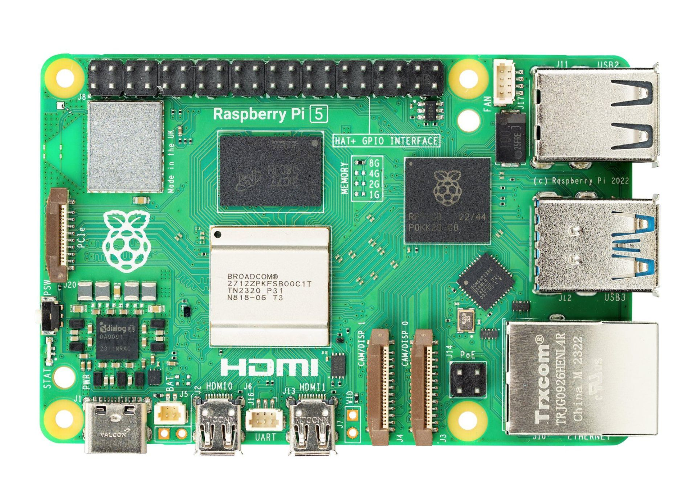
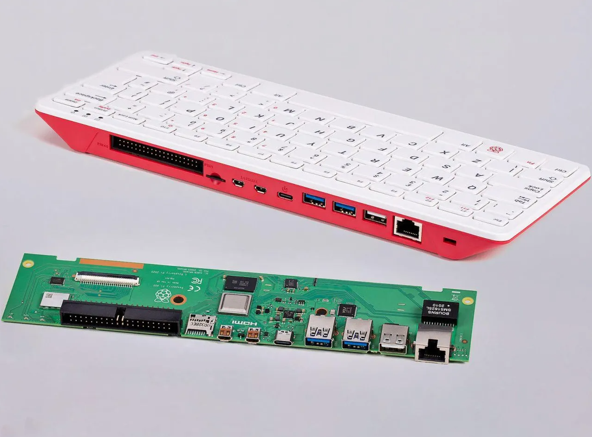
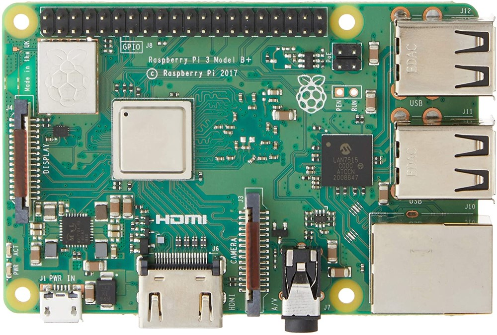
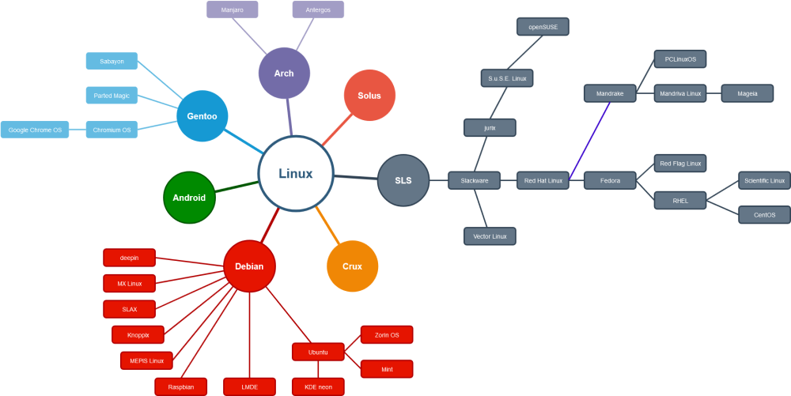
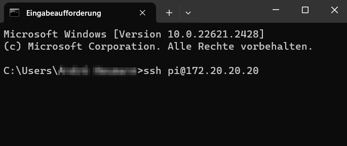
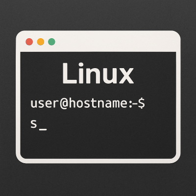
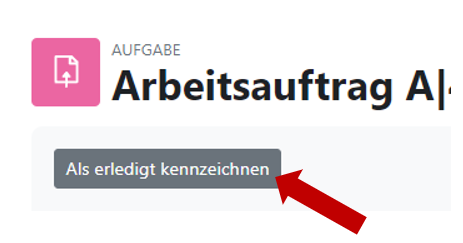
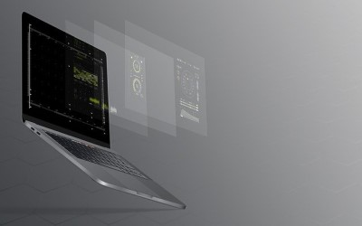

# Kapitel 4: IT-Systeme in Betrieb nehmen

In diesem Kapitel werden Sie ...

- Vorbereitungen für die Inbetriebnahme eines IT-Systems treffen.
- ein passendes Betriebssystem auswählen.
- die Linux-Kommandozeile nutzen, um ein IT-System zu bedienen
- ein Betriebssystem installieren und aktualisieren.
- die Funktionstüchtigkeit eines IT-Systems prüfen.
- den Inbetriebnahmeprozess dokumentieren und auswerten.

---

## Handlungssituation

Für den unternehmensinternen Auftrag der Change IT GmbH, eine Temperaturmesseinrichtung für die Arbeitsplätze einzurichten, wurde vor einigen Wochen eine Bestellung für die benötigte Hardware getätigt. Der Wareneingang hat diese angenommen und äußerlich auf Schäden kontrolliert. Ihre Aufgabe sind die Vorbereitungen für den Einsatz sowie wie Inbetriebnahme des IT-Systems durchzuführen. Hieran anschließend soll die Funktionstüchtigkeit des IT-Systems getestet werden.

---

## Kompetenz 4.0: Vorbereitungen der Inbetriebnahme eines IT-Systems treffen

Die Hardware ist durch die Warenannahme der Change IT angenommen und innerbetrieblich weitergeleitet worden. Bei Anlieferung wurde lediglich die Überprüfung des korrekten Warenempfängers vorgenommen sowie die Unversehrtheit der Verpackung geprüft.

Der Raspberry Pi und das Zubehör sollen nun in Betrieb genommen werden. Dafür sind die Komponenten richtig zusammenzubauen. Im ersten Schritt sollen die Komponenten des Raspberry Pi und die weiteren Inhalte des Sets genauer betrachtet werden.

---

### Arbeitsauftrag A|4.0: Kontrolle der Vollständigkeit

#### Aufgabe 1

Breiten Sie das Raspberry Pi-Material vor Ihnen auf dem Tisch aus und fertigen Sie ein Foto an, welches alle Bauteile auf einen Blick enthält.

### Arbeitsauftrag A|4.1: Komponenten des Raspberry Pi erkunden

#### Aufgabe 1

Laden Sie sich aus dem Kursmaterial (M|4.0: Bilder des Raspberry Pi) das zu Ihrem Raspberry Pi passende Bild herunter. Beschriften Sie anschließend die Anschlüsse des Raspberry Pi auf dem Bild.

### Informationsmaterial M|4.0: Bilder des Raspberry Pi

#### Raspberry Pi 5

*Quelle des Bildes: https://www.berrybase.de/thumbnail/a1/82/d1/1722543509/RaspberryPi54GBRAM-230062_1920x1920.jpg?ts=1724768071*

#### Raspberry Pi 400

*Quelle des Bildes: https://www.zdnet.com/article/raspberry-pi-400-its-designer-reveals-more-about-the-faster-pi-4-in-the-70-pcs-keyboard/*

#### Raspberry Pi 4B

*Quelle des Bildes: https://cdn.idealo.com/folder/Product/6628/1/6628198/s1_produktbild_max/raspberry-pi-4-model-b.jpg*

#### Raspberry Pi 3B+

*Quelle des Bildes: https://m.media-amazon.com/images/I/81hyqDgm8vL.AC_SL1500.jpg*

### M|4.1a: Produktdatenblatt zum Raspberry Pi 5

[Download Produktdatenblatt RPi 5](material/kap_04_Datenblatt_RPi_5.pdf)

### M|4.1b: Produktdatenblatt zum Raspberry Pi 400

[Download Produktdatenblatt RPi 400](material/kap_04_Datenblatt_RPi_400.pdf)

### M|4.1c: Produktdatenblatt zum Raspberry Pi 4B

[Download Produktdatenblatt RPi 4B](material/kap_04_Datenblatt_RPi_4B.pdf)

### M|4.1d: Produktdatenblatt zum Raspberry Pi 3B+

[Download Produktdatenblatt RPi 3B+](material/kap_04_Datenblatt_RPi_3Bplus.pdf)

### Arbeitsauftrag A|4.2: Fragen zum Raspberry Pi

Ein Praktikant der ChangeIT GmbH soll Sie bei dem Raspberry Pi-Projekt unterstützen. Dabei sind im Gespräch folgende Fragen aufgekommen. Beantworten Sie diese jeweils mithilfe des Materials im Kurs (M|4.2: Raspberry Pi - Grundlagen der Energieversorgung / Stromversorgung) begründet in einem kurzen Satz:

#### Aufgabe 1

Mit welcher Ausgangsspannung arbeitet das Netzteil für den Raspberry Pi?

#### Aufgabe 2

Welche Spannung(en) kann der Raspberry Pi über die GPIO-Pins an Bauteile ausgeben?

#### Aufgabe 3

Welche Stromstärke sollte ein Netzteil für den Raspberry Pi 4 (bzw. 3) mindestens liefern?

#### Aufgabe 4

Darf der Raspberry Pi mit einem Netzteil betrieben werden, welches 4 A liefert?

#### Aufgabe 5

Darf der Raspberry Pi mit einem Netzteil betrieben werden, welches 12 V liefert?

#### Aufgabe 6

Wie hoch ist die sichere Stromstärke für den Gesamtstrom aller GPIO?

#### Aufgabe 7

Wie hoch ist die sichere Stromstärke für einen einzelnen GPIO im Optimum?

### M|4.2: Raspberry Pi - Grundlagen der Energieversorgung / Stromversorgung

#### Grundlagen der Energieversorgung

Mini-Computer, wie der Raspberry Pi, bedürfen einer stabilen Spannungs- UND Stromversorgung. Bei einem schlechten Netzteil und ungünstigen Betriebsbedingungen treten merkwürdige Effekte in Kombination mit einem instabilen Systemverhalten auf. Oftmals sind dies abbrechende LAN- und WLAN-Verbindungen und anderweitiges Fehlverhalten von Geräten, die per USB angeschlossen sind.

Raspberry Pi sind auf eine stabilisierte Betriebsspannung von in der Regel ca. 5 Volt angewiesen. Wenn der Raspberry Pi mit einem beliebigen Steckernetzteil betrieben wird, dann kann und wird das in der Regel funktionieren. Wenn jetzt aber der Raspberry Pi und angeschlossene USB-Geräte für eine impulsive Stromentnahme sorgen, dann kann es vorkommen, dass das Steckernetzteil überfordert ist, aussetzt und die Spannung daraufhin einbricht. Also deutlich unter 5 Volt fällt.

Was passiert dann? Ein Gerät, das für 5 Volt konzipiert ist, kommt dann in einen instabilen Betriebszustand. Hinzu kommt, dass USB-Geräte 5 Volt am USB-Port erwarten. Laut USB-Spezifikation sollte ein USB-Gerät zwischen 4,45 und 5,5 Volt funktionieren.

Bei Unterspannung nimmt der Raspberry Pi seine USB-Ports außer Betrieb, um die Stabilität der Stromversorgung durch Reduzierung der Stromentnahme wieder herzustellen. Dabei gehen zumindest kurzzeitig alle USB-Geräte außer Betrieb. Und das führt dann eben zu besagten Fehlfunktionen einzelner USB-Geräte oder des gesamten Systems und erklärt die Aussetzer bei den USB-Geräten. Das betrifft Maus, Tastatur, WLAN- und LAN-Verbindungen, sowie USB-Speichergeräte.

Grundsätzlich wird der Raspberry Pi mit einer Spannung von 5 Volt am Micro-USB-Eingang mit Energie versorgt. Genau genommen sind es 5,1 V, was die meisten USB-Steckernetzteile auch liefern. Es sind deshalb 5,1 V, weil durch Steckverbindungen und Leitungen Verluste entstehen.

Der zweite wichtige Wert bei der Energieversorgung ist der Stromverbrauch, der in Ampere angegeben wird. Wie viel Strom der Raspberry Pi genau braucht hängt davon ab, was daran angeschlossen ist. In der Regel reicht ein Netzteil mit 2,5-3 A (je nach Raspberry Pi) aus. Aber nur dann, wenn man keine stromhungrigen USB-Geräte anschließt. Dann braucht man einen extern gespeisten USB-Hub oder sollte ein Netzteil mit mindestens 2,5 A verwenden. Wichtig ist zu wissen, mehr als 2,5 A kann ein Raspberry Pi nicht ziehen. Wenn das Gesamtsystem mehr Strom braucht, dann wird das durch eine Sicherung begrenzt und zu Instabilitäten führen kann.

Netzteile werden für den Betrieb in der Regel ca. 20 bis 30 % überdimensioniert. Unter Dauerlast bei voller Auslastung kann es zu Problemen für das Netzteil kommen.

Stromversorgung: Raspberry Pi 3B
Speziell beim Raspberry Pi 3 sollte man wissen, dass dieser über einen Konstruktionsfehler verfügt. Wegen eines neuen Leiterplattendesigns und Einsparungen beim Einsatz minderwertiger Bauteile fallen auf dem Weg zwischen Micro-USB-Buchse und dem Chip bis zu 0,6 Volt ab. Das führt dazu, dass der Raspberry Pi 3 mit einem herkömmlichen USB-Netzteil mit 5,1 V an der Grenze der Unterspannung betrieben wird. Das Problem wird dadurch behoben, dass das offizielle Netzteil für den Raspberry Pi 3 eine Spannung von 5,2 Volt hat.

Stromversorgung: Raspberry Pi 4B
Im Gegensatz zu den Modellen davor braucht der Raspberry Pi 4B ein USB-Netzteil mit 5 Volt und 3 Ampere mit USB-Typ-C (Steckverbindung). Hierbei muss beachtet werden, dass beim Raspberry Pi 4B der USB-C-Port fehlerhaft implementiert ist und aktive USB-C-Kabel (mit E-Mark-Chip) den Raspberry Pi 4B als Audio-Adapter erkennen und deshalb keinen Strom ausgeben.

Abhilfe schafft ein einfaches USB-C-Kabel ohne den E-Mark-Chip. Solche Kabel liegen meist als Ladekabel für Smartphones bei. Die üblichen Kabel für Notebooks, Thunderbold usw. sind für den Betrieb des Raspberry Pi 4B nicht geeignet. Die Raspberry Pi Foundation hat eine Revision angekündigt, weshalb es neuere Raspberry Pi 4B gibt, bei der dieses Problem nicht besteht.

*Quelle: https://www.elektronik-kompendium.de/sites/raspberry-pi/1912111.htm*

#### Maximale Stromstärke der GPIO

Eines vorneweg, der Gesamtstrom aller GPIOs sollte 50 mA nicht übersteigen. Denn das ist die größte Stromstärke (mit Reserve natürlich) die ein Bond (das dünne Drähtchen vom "Beinchen" des Schaltkreises zur eigentlichen internen Schaltung) aushalten kann.

Die gesamte Elektronik eines (einzelnen) Anschlusses ist für maximal 16 mA ausgelegt. Das heißt, es treten bis 16 mA keine Schäden auf. Alles darüber ist unsicher. Auch wenn der eine oder andere Bastler deutlich mehr aus einem GPIO bekommt.
Der Bereich, in dem die Ausgangsendstufen eines GPIO sicher arbeiten reicht von 2 bis 16 mA. Als Optimum liegt zwischen 3 und 8 mA. Mit mehr als 8 mA sollte man nicht rechnen. Aber auch nicht weniger als 2 mA.

*Quelle: https://www.elektronik-kompendium.de/sites/raspberry-pi/2006031.htm*

## Kompetenz 4.1: Betriebssystem auswählen

Für die Temperatur-Messeinheit der Change IT GmbH soll ein Raspberry Pi eingesetzt werden. Nicht jedes Linux-Betriebssystem kann auf dem Raspberry Pi installiert werden. Für diesen stehen allerdings verschiedene spezialisierte Betriebssysteme zur Verfügung. Sie wollen sich einen Überblick zu den Linux-Varianten verschaffen, um ein passendes System auszuwählen. Nach der Einrichtung der Temperatur-Messeinheiten werden die Raspberry Pi ferner nicht mehr per Bildschirm, Maus und Tastatur bedient. Vielmehr ist eine Remote-Bedienung vorgesehen. Auch hierzu fehlen noch Informationen, bevor das IT-System in Betrieb genommen werden kann.

### A|4.4: Linux-Distributionen unterscheiden

#### Aufgabe 1

Was sind Linux-Distributionen (s. M|4.4: Linux-Distributionen im Überblick)? Beschreiben Sie in eigenen Worten.

### M|4.4: Linux-Distributionen im Überblick

Bei Windows ist die Sache einfach: Hersteller Microsoft bringt eine neue Version raus und zeitweise gibt es noch den Vorgänger - das war es auch schon an Auswahl. Bei Linux sieht die Sache etwas anders aus. Es gibt nämlich nicht "das Linux". Genau genommen müsste man das Ganze sowieso GNU/Linux nennen: Was man gemeinhin Linux nennt, besteht aus einem Kernel, eben Linux, und einer Reihe von Standard-Werkzeugen, den GNU Tools. Aber lassen wir das mal beiseite und sprechen wie üblich einfach von Linux. Diese Kernelemente finden Sie in allen Linuxen, genauer gesagt Linux-Distributionen, kurz Distris genannt. Da die Linux-Basis Open Source Software ist, kann sich jeder ein eigenes System basteln und distribuieren - daher der Name Distri.

Und genau dort liegen die großen Unterschiede: Wer entwickelt das System? Was kommt in das System? Wie wird veröffentlicht? Welche zusätzlichen Tools gehören dazu? Und wie genau sieht der Desktop aus? Manche Distris werden hauptsächlich von dahinter stehenden Firmen herausgegeben, etwa Ubuntu von Canonical oder Red Hat Enterprise Linux von Red Hat. Andere Distributionen sind komplett Community-betreut, allen voran Debian. Die meisten großen Distris spendieren Ihren Linuxen auch eigene Tools rund um das System - insbesondere das, was man unter Windows als "Systemsteuerung" kennt, löst jede Distri auf eigene Art. Die "großen" Anwendungsprogramme wie Office (LibreOffice) oder Bildbearbeitung (Gimp) finden sich natürlich überall. Wichtig ist dabei auch, wie ernst die Projekte den Freiheitsgedanken nehmen: Wo Debian standardmäßig nur auf freie, quelloffene Software setzt, baut Ubuntu auch unfreie Software ein, beispielsweise Grafikkartentreiber oder Multimedia-Codecs. Auch die Update-Politiken unterscheiden sich: Teils wird zu fixen Terminen veröffentlicht, teils landen aktualisierte Pakete kontinuierlich in den so genannten Repositories. Apropos: Jede Distri hat ein solches dazugehörige "Repo", aus dem sich über das Paketmanagement ganz einfach Programme installieren lassen - Debian kommt auf über 50.000 Pakete.

Für die meisten Heimanwender stellt sich vor allem eine Frage: Wie sieht der Desktop aus? Bei Windows sind OS und Desktop untrennbar verbunden, bei Linux ist die gesamte Desktop-Umgebung im Grunde nur ein Anwendungsprogramm, das nach Belieben installiert und ausgetauscht werden kann. Alle Systeme haben einen Standard-Desktop, aber man kann ihn auswechseln. Bestes Beispiel: Ubuntu gibt es auch als Lubuntu, Kubuntu und Xubuntu, was für die Standard-Desktops LXDE, KDE und XFCE steht. Zwar verändern die Projektteams hier und da auch noch andere Details, aber im Grunde könnten Sie einfach Ubuntu aufsetzen und dann LXDE, KDE (heute Plasma) und XFCE installieren - und beim Start wählen Sie dann das gewünschte System.

Nicht alle Aspekte sind für jeden wichtig, aber damit haben Sie schon mal eine Grundlage für die Auswahl. Lässt man die Technik mal außen vor, unterscheiden sich die Distris aus Nutzersicht in Fragen wie: Wie schlank ist das System? Wie komfortabel? Wie frei? Wie gut dokumentiert?

*Quellen:*
- *https://www.heise.de/tipps-tricks/Linux-Betriebssysteme-eine-Uebersicht-4119937.html*
- *https://codezentrale.de/linux-stammbaum-linux-distributionen/*

---

### A|4.5: Linux-Systeme remote bedienen

Informieren Sie sich mithilfe des Materials im Kurs (M|4.5: SSH, VNC und Telnet) und beantworten Sie die folgenden Fragen:

#### Aufgabe 1

Was ist eine SSH-Verbindung?

#### Aufgabe 2

Welche Software wird für den Aufbau einer SSH-Verbindung auf der Client- sowie auf der Server-Seite benötigt?

#### Aufgabe 3

Was ist der Unterschied zwischen SSH und VNC?

#### Aufgabe 4

Was ist der Unterschied zwischen SSH und Telnet?

#### Aufgabe 5

Welche Vor- und Nachteile hat eine Remote-Wartung gegenüber einer Vor-Ort-Wartung von IT-Systemen?

### M|4.5: Secure Shell (SSH) und Virtual Network Computing (VNC)

#### Secure Shell (SSH)

Secure Shell (SSH) ist ein Netzwerkprotokoll, das entwickelt wurde, um eine sichere Kommunikation über ein unsicheres Netzwerk zu ermöglichen. Typischerweise wird SSH verwendet, um eine verschlüsselte Verbindung zu einem entfernten Server herzustellen und so eine sichere Datenübertragung, Authentifizierung und Interaktion mit dem entfernten System zu gewährleisten.

*Bildquelle: https://de.wikipedia.org/wiki/Secure_Shell*

- **Verschlüsselte Verbindungen:** SSH verschlüsselt die Kommunikation zwischen dem Client und dem Server, was bedeutet, dass sensible Daten wie Passwörter, Befehle und Dateiübertragungen vor unbefugtem Zugriff geschützt sind.
- **Authentifizierung:** SSH ermöglicht die sichere Authentifizierung von Benutzern, um sicherzustellen, dass nur autorisierte Personen auf das System zugreifen können. Dies kann durch Passwörter, Schlüsselpaare oder andere Authentifizierungsmethoden erfolgen.
- **Sichere Datenübertragung:** Dateien können sicher über SSH übertragen werden. Dies wird oft durch den Einsatz von SCP (Secure Copy) oder SFTP (Secure File Transfer Protocol) erreicht.
- **Portabilität:** SSH ist plattformunabhängig und kann auf verschiedenen Betriebssystemen wie Linux, macOS und Windows verwendet werden.
- **Remote-Shell-Zugriff:** Eines der Hauptanwendungsgebiete von SSH ist der Zugriff auf eine Remote-Shell auf einem entfernten Server. Dies ermöglicht es Benutzern, Befehle auf einem entfernten System auszuführen, als ob sie direkt vor dessen Bildschirm sitzen würden.

**Aufbau einer SSH-Verbindung**

Sie benötigen in der Regel keine zusätzliche Software. Ein Terminal-Fenster Ihres Betriebssystems reicht hierfür aus.

Mit dem Befehl `ssh pi@172.20.20.20` verbinden Sie sich als Benutzer `pi` via SSH mit dem Remote-System, welches im Beispiel die IP `172.20.20.20` hat.

#### Virtual Network Computing

Virtual Network Computing (VNC) ist eine Technologie, die es ermöglicht, den Bildschirminhalt eines Computers über ein Netzwerk zu übertragen und die Tastatureingaben und Mausbewegungen von einem entfernten Standort aus zu steuern. Mit VNC kann ein Benutzer von einem Computer aus auf einen anderen Computer zugreifen, als ob er direkt vor diesem sitzen würde. Die Technologie ermöglicht Remote-Desktop-Zugriff und -kontrolle.

- **Server:** Auf dem Computer, dessen Bildschirminhalt freigegeben werden soll, muss ein VNC-Server installiert und gestartet werden. Der VNC-Server erfasst den Bildschirminhalt und wartet auf eingehende Verbindungen.
- **Client:** Der Computer, der auf den entfernten Bildschirminhalt zugreifen möchte, benötigt einen VNC-Client. Dieser Client stellt eine Verbindung zum VNC-Server her und empfängt die übertragenen Bildschirminhalte.
- **Übertragungsprotokoll:** VNC verwendet ein spezifisches Protokoll (z. B. RFB - Remote Framebuffer Protocol), um den Bildschirminhalt zu übertragen und Benutzereingaben zu steuern. Dieses Protokoll ermöglicht die Übertragung von Grafiken, Mausbewegungen und Tastatureingaben über das Netzwerk.
- **Verschlüsselung (optional):** In einigen VNC-Implementierungen kann eine Verschlüsselung aktiviert werden, um die übertragenen Daten zu schützen. Dies ist besonders wichtig, wenn VNC über unsichere Netzwerke wie das Internet verwendet wird, um die Privatsphäre und Sicherheit zu gewährleisten.

### Telnet

Telnet steht für "Telecommunication Network" und ist ein Netzwerkprotokoll, das für die remote textbasierte Kommunikation zwischen Computern über ein TCP/IP-Netzwerk verwendet wird. Es wurde ursprünglich für den Zugriff auf entfernte Systeme und die Fernadministration entwickelt. Telnet ermöglicht es einem Benutzer, von einem Computer aus eine Verbindung zu einem anderen Computer herzustellen und eine Eingabeaufforderung oder ein Terminalfenster auf dem entfernten System zu öffnen.

Es ist wichtig zu beachten, dass Telnet in seiner grundlegenden Form keine Verschlüsselung für die übertragenen Daten bietet. Alle Informationen, einschließlich Benutzernamen und Passwörtern, werden im Klartext über das Netzwerk übertragen. Aus diesem Grund ist die Verwendung von Telnet über unsichere Netzwerke, wie das Internet, nicht ratsam, da es ein erhebliches Sicherheitsrisiko darstellt. Unautorisierte Personen könnten den Netzwerkverkehr mithören und sensible Informationen abfangen.

Aufgrund der Sicherheitsbedenken wird Telnet heute oft durch sicherere Alternativen wie SSH (Secure Shell) ersetzt, das eine verschlüsselte Verbindung für die Remote-Administration bietet und somit die Integrität und Vertraulichkeit der übertragenen Daten gewährleistet.

## Kompetenz 4.2: Linux-Kommandozeile bedienen

Die IT-Abteilung der Change IT GmbH hat sich bei den eingesetzten IT-Systemen für die Wartung und Konfiguration via SSH entschieden. Hierbei fallen Standardaufgaben an, die eine Bedienung des Linux-Systems mit sich bringt. Kurz danach erhalten Sie den Auftrag ein Remote-System mit dem Betriebssystem Raspberry Pi OS (x86) für ein Projekt vorzubereiten und zu testen.

@TODO

## Kompetenz 4.3: Installation und Aktualisierung des Betriebssystems

Der Raspberry Pi ist hardwareseitig einsatzbereit, aktuell fehlt allerdings noch die Software. Die Change IT GmbH nutzt nach Ihrem Vorschlag ein Raspberry Pi OS als Betriebssystem. Dieses wurde in der internen IT-Abteilung bereits so vorbereitet, dass die Endgeräte in das WLAN kommen. Das Betriebssystem steht in einem sogenannten Image bereit. Dieses Image ist eine Momentaufnahme des Betriebssystems, welches auf Micro SD-Karten dupliziert und von dort wieder gestartet werden kann. Nehmen Sie die Installation und erste Aktualisierung auf Ihrem Raspberry Pi vor.

### A|4.6: Inbetriebnahme des Raspberry Pi

Sie benötigen für die Schritte der Inbetriebnahme folgende Programme:

- Raspberry Pi Imager ([Download](https://www.raspberrypi.org/downloads/))
- MMBbS Raspberry Pi OS Image ([Download](https://mm-bbs.de) über die Landingpage)

Die Anleitung zur Installation des Betriebssystems finden Sie im Kurs.

Wenn Sie diese Aufgabe fertiggestellt haben bestätigen Sie dies über den oben aufgeführten Button:

### M|4.6: Inbetriebnahme des Raspberry Pi

<iframe frameborder="0" width="1200" height="675" style="position: absolute; top: 0; left: 0; width: 100%; height: 100%;" src="https://view.genial.ly/6019653b31720d0d312eb43c" type="text/html" allowscriptaccess="always" allowfullscreen="true" scrolling="yes" allownetworking="all"></iframe>

## Kompetenz 4.4: Funktionstüchtigkeit eines IT-Systems prüfen

Nach der Installation und Aktualisierung des Betriebssystems ist der Inbetriebnahmeprozess abgeschlossen. Zunächst soll die Funktionstüchtigkeit des Raspberry Pi im Netzwerk überprüft werden. Erst im Anschluss kann das Prototyping mit dem Auslesen von Sensorik starten.

### A|4.14: Basisinformationen zum Raspberry Pi anzeigen

#### Aufgabe 1

Lassen Sie sich die Eckdaten zu Ihrem Raspberry Pi mit dem Befehl "pinout" in der Kommandozeile anzeigen. Welche Informationen können Sie hieraus ablesen?

#### Aufgabe 2

Nutzen Sie in der Kommandozeile den Befehl zur Ausgabe von Netzwerk-Informationen "ifconfig". Geben Sie in eigenen Worten wieder, was Ihnen die Anzeige an Daten ausgibt.

#### Aufgabe 3

Starten Sie mit dem Befehl "htop" den Taskmanager. Verschaffen Sie sich einen groben Überblick über das angezeigte Programm und beschreiben Sie den grundlegenden Aufbau der Ansicht.

## Handlungsergebnis

Sie haben in den letzten Unterrichtsstunden die Inbetriebnahme des Raspberry Pi durchgeführt, sich mit der Bedienung von Linux via Kommandozeile auseinandergesetzt sowie erste technische Informationen aus dem System ausgelesen. An dieser Stelle sollen Sie den aktuellen Standpunkt im Sinne eines Lessons Learned auswerten.

### A|4.15: Inbetriebnahme, Installation und Funktionstest auswerten

#### Aufgabe 1

Betrachten Sie den Ablauf der Inbetriebnahme und die ersten Schritte im Betriebssystem mit dem Raspberry Pi. Beantworten Sie die folgenden Fragen:

- Wie zufrieden bin ich mit dem Ergebnis der Inbetriebnahme-Prozesses des Raspberry Pi?
- Was würde ich beim nächsten Installationsprozess anders machen?
- Was hat gut funktioniert und worauf kann ich stolz sein?

## GitHub

### GitHub.io - LF2-Kurs als MkDocs-Variante

[https://herr-nm.github.io/MMBbS_FISI_LF02/](https://herr-nm.github.io/MMBbS_FISI_LF02/)

