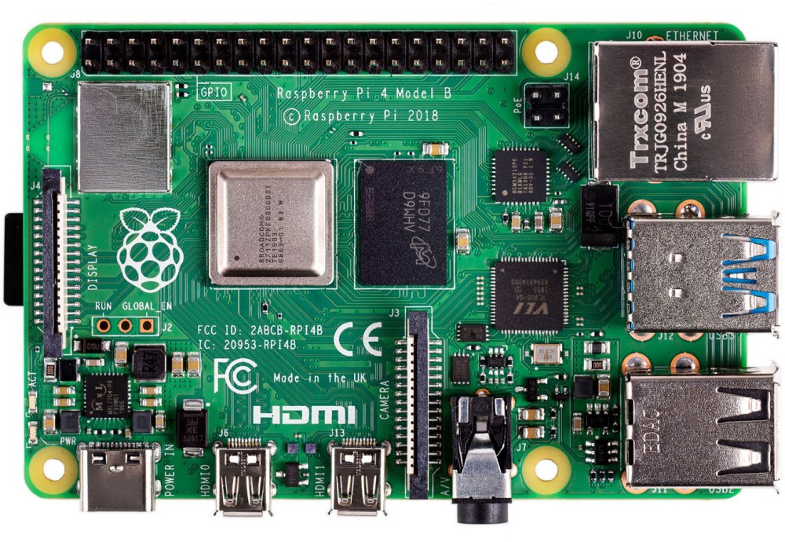
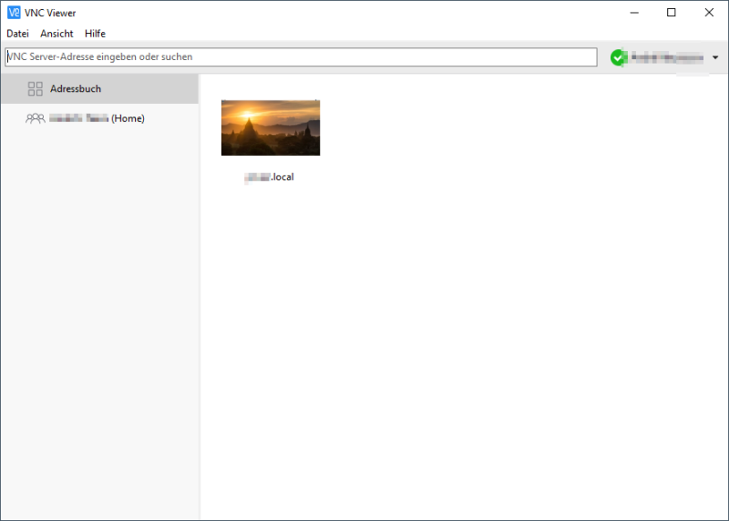

# Kapitel 4: IT-Systeme in Betrieb nehmen


In diesem Kapitel werden Sie ...

- Vorbereitungen für die Inbetriebnahme eines IT-Systems treffen.
- ein passendes Betriebssystem auswählen.
- die Linux-Kommandozeile nutzen, um ein IT-System zu bedienen
- ein Betriebssystem installieren und aktualisieren.
- die Funktionstüchtigkeit eines IT-Systems prüfen.
- den Inbetriebnahmeprozess dokumentieren und auswerten.

---

## Handlungssituation

Für den unternehmensinternen Auftrag der Change IT GmbH, eine Temperaturmesseinrichtung für die Arbeitsplätze einzurichten, wurde vor einigen Wochen eine Bestellung für die benötigte Hardware getätigt. Der Wareneingang hat diese angenommen und äußerlich auf Schäden kontrolliert. Ihre Aufgabe sind die Vorbereitungen für den Einsatz sowie wie Inbetriebnahme des IT-Systems durchzuführen. Hieran anschließend soll die Funktionstüchtigkeit des IT-Systems getestet werden.


---

## Kompetenz 4.0: Vorbereitungen der Inbetriebnahme eines IT-Systems treffen

Die Hardware ist durch die Warenannahme der Change IT angenommen und innerbetrieblich weitergeleitet worden. Bei Anlieferung wurde lediglich die Überprüfung des korrekten Warenempfängers vorgenommen sowie die Unversehrtheit der Verpackung geprüft.

Der Raspberry Pi und das Zubehör sollen nun in Betrieb genommen werden. Dafür sind die Komponenten richtig zusammenzubauen. Im ersten Schritt sollen die Komponenten des Raspberry Pi und die weiteren Inhalte des Sets genauer betrachtet werden.


---

### Arbeitsauftrag A|4.0: Kontrolle der Vollständigkeit

#### Aufgabe 1

Breiten Sie das Raspberry Pi-Material vor Ihnen auf dem Tisch aus und fertigen Sie ein Foto an, welches alle Bauteile auf einen Blick enthält.

### Arbeitsauftrag A|4.1: Komponenten des Raspberry Pi erkunden

#### Aufgabe 1

Laden Sie sich aus dem Kursmaterial (M|4.0: Bilder des Raspberry Pi) das zu Ihrem Raspberry Pi passende Bild herunter. Beschriften Sie anschließend die Anschlüsse des Raspberry Pi auf dem Bild.

### Informationsmaterial M|4.0: Bilder des Raspberry Pi

#### Raspberry Pi 400


*Quelle des Bildes: https://www.zdnet.com/article/raspberry-pi-400-its-designer-reveals-more-about-the-faster-pi-4-in-the-70-pcs-keyboard/*

#### Raspberry Pi 4B



*Quelle des Bildes: https://cdn.idealo.com/folder/Product/6628/1/6628198/s1_produktbild_max/raspberry-pi-4-model-b.jpg*

#### Raspberry Pi 3B+


*Quelle des Bildes: https://m.media-amazon.com/images/I/81hyqDgm8vL.AC_SL1500.jpg*

#### Raspberry Pi 3B


*Quelle des Bildes: https://de.farnell.com/productimages/large/de_DE/2525225-40.jpg*

### M|4.1a: Produktdatenblatt zum Raspberry Pi 400

[Download Produktdatenblatt RPi 400](material/kap_04_Datenblatt_RPi_400.pdf)

### M|4.1b: Produktdatenblatt zum Raspberry Pi 4B

[Download Produktdatenblatt RPi 4B](material/kap_04_Datenblatt_RPi_4B.pdf)

### M|4.1c: Produktdatenblatt zum Raspberry Pi 3B+

[Download Produktdatenblatt RPi 3B+](material/kap_04_Datenblatt_RPi_3Bplus.pdf)

### M|4.1d: Produktdatenblatt zum Raspberry Pi 3B

[Download Produktdatenblatt RPi 3B](material/kap_04_Datenblatt_RPi_3B.pdf)

### Arbeitsauftrag A|4.2: Fragen zum Raspberry Pi

Ein Praktikant der ChangeIT GmbH soll Sie bei dem Raspberry Pi-Projekt unterstützen. Dabei sind im Gespräch folgende Fragen aufgekommen. Beantworten Sie diese jeweils mithilfe des Materials im Kurs (M|4.2: Raspberry Pi - Grundlagen der Energieversorgung / Stromversorgung) begründet in einem kurzen Satz:

#### Aufgabe 1

Mit welcher Ausgangsspannung arbeitet das Netzteil für den Raspberry Pi?

#### Aufgabe 2

Welche Spannung(en) kann der Raspberry Pi über die GPIO-Pins an Bauteile ausgeben?

#### Aufgabe 3

Welche Stromstärke sollte ein Netzteil für den Raspberry Pi 4 (bzw. 3) mindestens liefern?

#### Aufgabe 4

Darf der Raspberry Pi mit einem Netzteil betrieben werden, welches 4 A liefert?

#### Aufgabe 5

Darf der Raspberry Pi mit einem Netzteil betrieben werden, welches 12 V liefert?

#### Aufgabe 6

Wie hoch ist die sichere Stromstärke für den Gesamtstrom aller GPIO?

#### Aufgabe 7

Wie hoch ist die sichere Stromstärke für einen einzelnen GPIO im Optimum?

### M|4.2: Raspberry Pi - Grundlagen der Energieversorgung / Stromversorgung

#### Grundlagen der Energieversorgung

Mini-Computer, wie der Raspberry Pi, bedürfen einer stabilen Spannungs- UND Stromversorgung. Bei einem schlechten Netzteil und ungünstigen Betriebsbedingungen treten merkwürdige Effekte in Kombination mit einem instabilen Systemverhalten auf. Oftmals sind dies abbrechende LAN- und WLAN-Verbindungen und anderweitiges Fehlverhalten von Geräten, die per USB angeschlossen sind.

Raspberry Pi sind auf eine stabilisierte Betriebsspannung von in der Regel ca. 5 Volt angewiesen. Wenn der Raspberry Pi mit einem beliebigen Steckernetzteil betrieben wird, dann kann und wird das in der Regel funktionieren. Wenn jetzt aber der Raspberry Pi und angeschlossene USB-Geräte für eine impulsive Stromentnahme sorgen, dann kann es vorkommen, dass das Steckernetzteil überfordert ist, aussetzt und die Spannung daraufhin einbricht. Also deutlich unter 5 Volt fällt.

Was passiert dann? Ein Gerät, das für 5 Volt konzipiert ist, kommt dann in einen instabilen Betriebszustand. Hinzu kommt, dass USB-Geräte 5 Volt am USB-Port erwarten. Laut USB-Spezifikation sollte ein USB-Gerät zwischen 4,45 und 5,5 Volt funktionieren.

Bei Unterspannung nimmt der Raspberry Pi seine USB-Ports außer Betrieb, um die Stabilität der Stromversorgung durch Reduzierung der Stromentnahme wieder herzustellen. Dabei gehen zumindest kurzzeitig alle USB-Geräte außer Betrieb. Und das führt dann eben zu besagten Fehlfunktionen einzelner USB-Geräte oder des gesamten Systems und erklärt die Aussetzer bei den USB-Geräten. Das betrifft Maus, Tastatur, WLAN- und LAN-Verbindungen, sowie USB-Speichergeräte.

Grundsätzlich wird der Raspberry Pi mit einer Spannung von 5 Volt am Micro-USB-Eingang mit Energie versorgt. Genau genommen sind es 5,1 V, was die meisten USB-Steckernetzteile auch liefern. Es sind deshalb 5,1 V, weil durch Steckverbindungen und Leitungen Verluste entstehen.

Der zweite wichtige Wert bei der Energieversorgung ist der Stromverbrauch, der in Ampere angegeben wird. Wie viel Strom der Raspberry Pi genau braucht hängt davon ab, was daran angeschlossen ist. In der Regel reicht ein Netzteil mit 2,5-3 A (je nach Raspberry Pi) aus. Aber nur dann, wenn man keine stromhungrigen USB-Geräte anschließt. Dann braucht man einen extern gespeisten USB-Hub oder sollte ein Netzteil mit mindestens 2,5 A verwenden. Wichtig ist zu wissen, mehr als 2,5 A kann ein Raspberry Pi nicht ziehen. Wenn das Gesamtsystem mehr Strom braucht, dann wird das durch eine Sicherung begrenzt und zu Instabilitäten führen kann.

Netzteile werden für den Betrieb in der Regel ca. 20 bis 30 % überdimensioniert. Unter Dauerlast bei voller Auslastung kann es zu Problemen für das Netzteil kommen.

Stromversorgung: Raspberry Pi 3B
Speziell beim Raspberry Pi 3 sollte man wissen, dass dieser über einen Konstruktionsfehler verfügt. Wegen eines neuen Leiterplattendesigns und Einsparungen beim Einsatz minderwertiger Bauteile fallen auf dem Weg zwischen Micro-USB-Buchse und dem Chip bis zu 0,6 Volt ab. Das führt dazu, dass der Raspberry Pi 3 mit einem herkömmlichen USB-Netzteil mit 5,1 V an der Grenze der Unterspannung betrieben wird. Das Problem wird dadurch behoben, dass das offizielle Netzteil für den Raspberry Pi 3 eine Spannung von 5,2 Volt hat.

Stromversorgung: Raspberry Pi 4B
Im Gegensatz zu den Modellen davor braucht der Raspberry Pi 4B ein USB-Netzteil mit 5 Volt und 3 Ampere mit USB-Typ-C (Steckverbindung). Hierbei muss beachtet werden, dass beim Raspberry Pi 4B der USB-C-Port fehlerhaft implementiert ist und aktive USB-C-Kabel (mit E-Mark-Chip) den Raspberry Pi 4B als Audio-Adapter erkennen und deshalb keinen Strom ausgeben.

Abhilfe schafft ein einfaches USB-C-Kabel ohne den E-Mark-Chip. Solche Kabel liegen meist als Ladekabel für Smartphones bei. Die üblichen Kabel für Notebooks, Thunderbold usw. sind für den Betrieb des Raspberry Pi 4B nicht geeignet. Die Raspberry Pi Foundation hat eine Revision angekündigt, weshalb es neuere Raspberry Pi 4B gibt, bei der dieses Problem nicht besteht.

*Quelle: https://www.elektronik-kompendium.de/sites/raspberry-pi/1912111.htm*

#### Maximale Stromstärke der GPIO

Eines vorneweg, der Gesamtstrom aller GPIOs sollte 50 mA nicht übersteigen. Denn das ist die größte Stromstärke (mit Reserve natürlich) die ein Bond (das dünne Drähtchen vom "Beinchen" des Schaltkreises zur eigentlichen internen Schaltung) aushalten kann.

Die gesamte Elektronik eines (einzelnen) Anschlusses ist für maximal 16 mA ausgelegt. Das heißt, es treten bis 16 mA keine Schäden auf. Alles darüber ist unsicher. Auch wenn der eine oder andere Bastler deutlich mehr aus einem GPIO bekommt.
Der Bereich, in dem die Ausgangsendstufen eines GPIO sicher arbeiten reicht von 2 bis 16 mA. Als Optimum liegt zwischen 3 und 8 mA. Mit mehr als 8 mA sollte man nicht rechnen. Aber auch nicht weniger als 2 mA.

*Quelle: https://www.elektronik-kompendium.de/sites/raspberry-pi/2006031.htm*

## Kompetenz 4.1: Betriebssystem auswählen

Für die Temperatur-Messeinheit der Change IT GmbH soll ein Raspberry Pi eingesetzt werden. Nicht jedes Linux-Betriebssystem kann auf dem Raspberry Pi installiert werden. Für diesen stehen allerdings verschiedene spezialisierte Betriebssysteme zur Verfügung. Sie wollen sich einen Überblick zu den Linux-Varianten verschaffen, um ein passendes System auszuwählen. Nach der Einrichtung der Temperatur-Messeinheiten werden die Raspberry Pi ferner nicht mehr per Bildschirm, Maus und Tastatur bedient. Vielmehr ist eine Remote-Bedienung vorgesehen. Auch hierzu fehlen noch Informationen, bevor das IT-System in Betrieb genommen werden kann.


### A|4.4: Linux-Distributionen unterscheiden

#### Aufgabe 1

Was sind Linux-Distributionen (s. M|4.4: Linux-Distributionen im Überblick)? Beschreiben Sie in eigenen Worten.

### M|4.4: Linux-Distributionen im Überblick

Bei Windows ist die Sache einfach: Hersteller Microsoft bringt eine neue Version raus und zeitweise gibt es noch den Vorgänger - das war es auch schon an Auswahl. Bei Linux sieht die Sache etwas anders aus. Es gibt nämlich nicht "das Linux". Genau genommen müsste man das Ganze sowieso GNU/Linux nennen: Was man gemeinhin Linux nennt, besteht aus einem Kernel, eben Linux, und einer Reihe von Standard-Werkzeugen, den GNU Tools. Aber lassen wir das mal beiseite und sprechen wie üblich einfach von Linux. Diese Kernelemente finden Sie in allen Linuxen, genauer gesagt Linux-Distributionen, kurz Distris genannt. Da die Linux-Basis Open Source Software ist, kann sich jeder ein eigenes System basteln und distribuieren - daher der Name Distri.

Und genau dort liegen die großen Unterschiede: Wer entwickelt das System? Was kommt in das System? Wie wird veröffentlicht? Welche zusätzlichen Tools gehören dazu? Und wie genau sieht der Desktop aus? Manche Distris werden hauptsächlich von dahinter stehenden Firmen herausgegeben, etwa Ubuntu von Canonical oder Red Hat Enterprise Linux von Red Hat. Andere Distributionen sind komplett Community-betreut, allen voran Debian. Die meisten großen Distris spendieren Ihren Linuxen auch eigene Tools rund um das System - insbesondere das, was man unter Windows als "Systemsteuerung" kennt, löst jede Distri auf eigene Art. Die "großen" Anwendungsprogramme wie Office (LibreOffice) oder Bildbearbeitung (Gimp) finden sich natürlich überall. Wichtig ist dabei auch, wie ernst die Projekte den Freiheitsgedanken nehmen: Wo Debian standardmäßig nur auf freie, quelloffene Software setzt, baut Ubuntu auch unfreie Software ein, beispielsweise Grafikkartentreiber oder Multimedia-Codecs. Auch die Update-Politiken unterscheiden sich: Teils wird zu fixen Terminen veröffentlicht, teils landen aktualisierte Pakete kontinuierlich in den so genannten Repositories. Apropos: Jede Distri hat ein solches dazugehörige "Repo", aus dem sich über das Paketmanagement ganz einfach Programme installieren lassen - Debian kommt auf über 50.000 Pakete.

Für die meisten Heimanwender stellt sich vor allem eine Frage: Wie sieht der Desktop aus? Bei Windows sind OS und Desktop untrennbar verbunden, bei Linux ist die gesamte Desktop-Umgebung im Grunde nur ein Anwendungsprogramm, das nach Belieben installiert und ausgetauscht werden kann. Alle Systeme haben einen Standard-Desktop, aber man kann ihn auswechseln. Bestes Beispiel: Ubuntu gibt es auch als Lubuntu, Kubuntu und Xubuntu, was für die Standard-Desktops LXDE, KDE und XFCE steht. Zwar verändern die Projektteams hier und da auch noch andere Details, aber im Grunde könnten Sie einfach Ubuntu aufsetzen und dann LXDE, KDE (heute Plasma) und XFCE installieren - und beim Start wählen Sie dann das gewünschte System.

Nicht alle Aspekte sind für jeden wichtig, aber damit haben Sie schon mal eine Grundlage für die Auswahl. Lässt man die Technik mal außen vor, unterscheiden sich die Distris aus Nutzersicht in Fragen wie: Wie schlank ist das System? Wie komfortabel? Wie frei? Wie gut dokumentiert?


*Quellen:*
- *https://www.heise.de/tipps-tricks/Linux-Betriebssysteme-eine-Uebersicht-4119937.html*
- *https://codezentrale.de/linux-stammbaum-linux-distributionen/*

---

### A|4.5: Linux-Systeme remote bedienen

Informieren Sie sich mithilfe des Materials im Kurs (M|4.5: SSH, VNC und Telnet) und beantworten Sie die folgenden Fragen:

#### Aufgabe 1

Was ist eine SSH-Verbindung?

#### Aufgabe 2

Welche Software wird für den Aufbau einer SSH-Verbindung auf der Client- sowie auf der Server-Seite benötigt?

#### Aufgabe 3

Was ist der Unterschied zwischen SSH und VNC?

#### Aufgabe 4

Was ist der Unterschied zwischen SSH und Telnet?

#### Aufgabe 5

Welche Vor- und Nachteile hat eine Remote-Wartung gegenüber einer Vor-Ort-Wartung von IT-Systemen?

### M|4.5: Secure Shell (SSH) und Virtual Network Computing (VNC)

#### Secure Shell (SSH)

Secure Shell (SSH) ist ein Netzwerkprotokoll, das entwickelt wurde, um eine sichere Kommunikation über ein unsicheres Netzwerk zu ermöglichen. Typischerweise wird SSH verwendet, um eine verschlüsselte Verbindung zu einem entfernten Server herzustellen und so eine sichere Datenübertragung, Authentifizierung und Interaktion mit dem entfernten System zu gewährleisten.


*Bildquelle: https://de.wikipedia.org/wiki/Secure_Shell*

- **Verschlüsselte Verbindungen:** SSH verschlüsselt die Kommunikation zwischen dem Client und dem Server, was bedeutet, dass sensible Daten wie Passwörter, Befehle und Dateiübertragungen vor unbefugtem Zugriff geschützt sind.
- **Authentifizierung:** SSH ermöglicht die sichere Authentifizierung von Benutzern, um sicherzustellen, dass nur autorisierte Personen auf das System zugreifen können. Dies kann durch Passwörter, Schlüsselpaare oder andere Authentifizierungsmethoden erfolgen.
- **Sichere Datenübertragung:** Dateien können sicher über SSH übertragen werden. Dies wird oft durch den Einsatz von SCP (Secure Copy) oder SFTP (Secure File Transfer Protocol) erreicht.
- **Portabilität:** SSH ist plattformunabhängig und kann auf verschiedenen Betriebssystemen wie Linux, macOS und Windows verwendet werden.
- **Remote-Shell-Zugriff:** Eines der Hauptanwendungsgebiete von SSH ist der Zugriff auf eine Remote-Shell auf einem entfernten Server. Dies ermöglicht es Benutzern, Befehle auf einem entfernten System auszuführen, als ob sie direkt vor dessen Bildschirm sitzen würden.

**Aufbau einer SSH-Verbindung**

Sie benötigen in der Regel keine zusätzliche Software. Ein Terminal-Fenster Ihres Betriebssystems reicht hierfür aus.

Mit dem Befehl `ssh pi@172.20.20.20` verbinden Sie sich als Benutzer `pi` via SSH mit dem Remote-System, welches im Beispiel die IP `172.20.20.20` hat.

#### Virtual Network Computing



Virtual Network Computing (VNC) ist eine Technologie, die es ermöglicht, den Bildschirminhalt eines Computers über ein Netzwerk zu übertragen und die Tastatureingaben und Mausbewegungen von einem entfernten Standort aus zu steuern. Mit VNC kann ein Benutzer von einem Computer aus auf einen anderen Computer zugreifen, als ob er direkt vor diesem sitzen würde. Die Technologie ermöglicht Remote-Desktop-Zugriff und -kontrolle.

- **Server:** Auf dem Computer, dessen Bildschirminhalt freigegeben werden soll, muss ein VNC-Server installiert und gestartet werden. Der VNC-Server erfasst den Bildschirminhalt und wartet auf eingehende Verbindungen.
- **Client:** Der Computer, der auf den entfernten Bildschirminhalt zugreifen möchte, benötigt einen VNC-Client. Dieser Client stellt eine Verbindung zum VNC-Server her und empfängt die übertragenen Bildschirminhalte.
- **Übertragungsprotokoll:** VNC verwendet ein spezifisches Protokoll (z. B. RFB - Remote Framebuffer Protocol), um den Bildschirminhalt zu übertragen und Benutzereingaben zu steuern. Dieses Protokoll ermöglicht die Übertragung von Grafiken, Mausbewegungen und Tastatureingaben über das Netzwerk.
- **Verschlüsselung (optional):** In einigen VNC-Implementierungen kann eine Verschlüsselung aktiviert werden, um die übertragenen Daten zu schützen. Dies ist besonders wichtig, wenn VNC über unsichere Netzwerke wie das Internet verwendet wird, um die Privatsphäre und Sicherheit zu gewährleisten.

### Telnet

Telnet steht für "Telecommunication Network" und ist ein Netzwerkprotokoll, das für die remote textbasierte Kommunikation zwischen Computern über ein TCP/IP-Netzwerk verwendet wird. Es wurde ursprünglich für den Zugriff auf entfernte Systeme und die Fernadministration entwickelt. Telnet ermöglicht es einem Benutzer, von einem Computer aus eine Verbindung zu einem anderen Computer herzustellen und eine Eingabeaufforderung oder ein Terminalfenster auf dem entfernten System zu öffnen.

Es ist wichtig zu beachten, dass Telnet in seiner grundlegenden Form keine Verschlüsselung für die übertragenen Daten bietet. Alle Informationen, einschließlich Benutzernamen und Passwörtern, werden im Klartext über das Netzwerk übertragen. Aus diesem Grund ist die Verwendung von Telnet über unsichere Netzwerke, wie das Internet, nicht ratsam, da es ein erhebliches Sicherheitsrisiko darstellt. Unautorisierte Personen könnten den Netzwerkverkehr mithören und sensible Informationen abfangen.

Aufgrund der Sicherheitsbedenken wird Telnet heute oft durch sicherere Alternativen wie SSH (Secure Shell) ersetzt, das eine verschlüsselte Verbindung für die Remote-Administration bietet und somit die Integrität und Vertraulichkeit der übertragenen Daten gewährleistet.

## Kompetenz 4.2: Installation und Aktualisierung des Betriebssystems

Der Raspberry Pi ist hardwareseitig einsatzbereit, aktuell fehlt allerdings noch die Software. Die Change IT GmbH nutzt nach Ihrem Vorschlag ein Raspberry Pi OS als Betriebssystem. Dieses wurde in der internen IT-Abteilung bereits so vorbereitet, dass die Endgeräte in das WLAN kommen. Das Betriebssystem steht in einem sogenannten Image bereit. Dieses Image ist eine Momentaufnahme des Betriebssystems, welches auf Micro SD-Karten dupliziert und von dort wieder gestartet werden kann. Nehmen Sie die Installation und erste Aktualisierung auf Ihrem Raspberry Pi vor.


### A|4.6: Inbetriebnahme des Raspberry Pi

Sie benötigen für die Schritte der Inbetriebnahme folgende Programme:

- Raspberry Pi Imager ([Download](https://www.raspberrypi.org/downloads/))
- MMBbS Raspberry Pi OS Image ([Download](https://mm-bbs.de) über die Landingpage)

Die Anleitung zur Installation des Betriebssystems finden Sie im Kurs.

Wenn Sie diese Aufgabe fertiggestellt haben bestätigen Sie dies über den oben aufgeführten Button:


### M|4.6: Inbetriebnahme des Raspberry Pi

<iframe frameborder="0" width="1200" height="675" style="position: absolute; top: 0; left: 0; width: 100%; height: 100%;" src="https://view.genial.ly/6019653b31720d0d312eb43c" type="text/html" allowscriptaccess="always" allowfullscreen="true" scrolling="yes" allownetworking="all"></iframe>

## Kompetenz 4.3: Linux-Kommandozeile bedienen

Die interne IT-Abteilung der ChangeIT GmbH hat sich bei den eingesetzten IT-Systemen für die Wartung und Konfiguration via SSH entschieden. Hierbei fallen Standardaufgaben an, die eine Bedienung des Linux-Systems mit sich bringt. Sie wollen sich eine Befehlsreferenz anlegen, um zukünftig schnell und sicher per SSH agieren zu können. Dazu wurden Fallbeispiele zusammengestellt, die durch Befehle bearbeitet werden sollen.


### A|4.7: Linux-Befehle für die Kommandozeile nutzen

#### Aufgabe 1

Verschaffen Sie sich mithilfe des Informationsmaterials im Kurs einen Überblick zu den wichtigsten Befehlen für die Linux-Kommandozeile. Notieren Sie sich die Befehle in übersichtlicher Form als Cheat-Sheet, welches Sie am Ende in dieser Aufgabe hochladen.

### M|4.7: Linux-Kommandozeilenbefehle

#### Befehlssyntax

Die Befehlszeile stellt ein leistungsfähiges Werkzeug dar und ist häufig die vorrangige Methode zur Verwaltung einer Vielzahl von Systemen, angefangen bei kleinen, stromsparenden Geräten bis hin zu hochleistungsfähigen Cloud-Computing-Servern und allem dazwischen. Ein grundlegendes Verständnis der Befehlszeile ist unverzichtbar für die Diagnose und Reparatur der meisten Linux-basierten Systeme. Angesichts der weitreichenden Verbreitung von Linux können selbst diejenigen, die nicht hauptsächlich mit Linux-Systemen arbeiten, von einem grundlegenden Verständnis der Befehlszeile profitieren.

Was genau ist ein Befehl? Ein Befehl stellt ein Softwareprogramm dar, das, wenn es auf der Befehlszeilenschnittstelle (CLI) ausgeführt wird, eine bestimmte Aktion auf dem Computer ausführt. Durch die Eingabe eines Befehls wird ein Prozess vom Betriebssystem gestartet, der Eingaben verarbeitet, Daten manipuliert und Ausgaben generiert. Um einen Befehl auszuführen, geben Sie zunächst den Namen des Befehls ein. 

Geben Sie bspw. `ls` (Kleinbuchstaben **L** und **S**) ein und drücken Sie die **Eingabetaste**, erhalten Sie folgende Ausgabe:

    pi@herr-nm:~$ ls
    Desktop  Documents  Downloads  Music  Pictures  Public  Templates  Videos

Häufig leitet sich der Name eines Befehls davon ab, was er bewirkt oder wie der Entwickler die Funktion des Befehls am besten beschreiben möchte. Ein Beispiel hierfür ist der Befehl `ls`, der eine Liste von Informationen zu Dateien anzeigt. Indem Sie den Namen eines Befehls mit seiner Funktion verknüpfen, können Sie dabei unterstützt werden, sich die Befehle leichter zu merken.

!!! note "Hinweis"

    Jeder Teil des Befehls wird normalerweise Groß- und Kleinschreibung beachtet, daher ist `LS` falsch und schlägt fehl, aber `ls` ist korrekt und wird ausgeführt.

    ```
    pi@herr-nm:~$ LS
    -bash: /usr/games/LS: Permission denied
    ```

Die meisten Befehle folgen einem einfachen Syntaxmuster:

    Befehl [Optionen…] [Argumente…]

Befehle werden eingegeben, gefolgt von Optionen und/oder Argumenten, bevor man die Eingabetaste drückt. In der Regel beeinflussen Optionen das Verhalten des Befehls, während Argumente die Elemente oder Werte darstellen, auf die der Befehl angewendet werden soll. Obwohl es in Linux einige Befehle gibt, die nicht vollständig dieser Syntax entsprechen, verwenden die meisten Befehle diese Struktur.

Im vorherigen Beispiel wurde der Befehl `ls` ohne Optionen oder Argumente ausgeführt. In diesem Fall resultiert das Standardverhalten darin, eine Liste der Dateien im aktuellen Verzeichnis zurückzugeben.

*Quelle: Cisco Netacad - Linux Unhatched - Stand 10.10.2023*

#### Argumente

Ein Argument dient dazu, dem Befehl Informationen zu übermitteln, auf den er angewendet werden soll. Beispielsweise kann der Befehl `ls` mit einem Verzeichnisnamen als Argument aufgerufen werden, um den Inhalt dieses Verzeichnisses anzuzeigen. Im folgenden Beispiel wird das Verzeichnis "Documents" als Argument verwendet:

    pi@herr-nm:~$ ls Documents
    MMBbS            ahorn.txt      esche.txt     linuxbefehle.txt
    Privat           birke.txt      script.sh     zeder.txt

Die resultierende Ausgabe ist eine Liste der Dateien, die im Verzeichnis `Documents` enthalten sind.

*Quelle: Cisco Netacad - Linux Unhatched - Stand 10.10.2023*

#### Optionen

Optionen werden eingesetzt, um das Verhalten eines Befehls zu modifizieren. In der vorherigen Erklärung wurde der Befehl `ls` genutzt, um den Inhalt eines Verzeichnisses aufzulisten. Im folgenden Beispiel wird dem Befehl `ls` die Option `-l` hinzugefügt, was zu einer „long display“-Ausgabe führt. Das bedeutet, dass die Ausgabe mehr Informationen zu jeder aufgelisteten Datei bereitstellt.

    pi@herr-nm:~$ ls -l
    total 12
    drwx------ 2 pi    pi   4096 Dec 20  2017 Desktop                        
    drwx------ 4 pi    pi   4096 Dec 20  2017 Documents                      
    drwx------ 2 pi    pi   4096 Dec 20  2017 Downloads                      
    drwx------ 2 pi    pi   4096 Dec 20  2017 Music                          
    drwx------ 2 pi    pi   4096 Dec 20  2017 Pictures                       
    drwx------ 2 pi    pi   4096 Dec 20  2017 Public                         
    drwx------ 2 pi    pi   4096 Dec 20  2017 Templates                      
    drwx------ 2 pi    pi   4096 Dec 20  2017 Videos

!!! note ""

    Im Beispiel wurde `-l`, also ein kleines L verwendet.

Mehrere Optionen können gleichzeitig verwendet werden, entweder als separate Optionen wie in `-l` `-r` oder kombiniert wie `-lr` . Das `-r` steht im Bezug zu `ls` für *reverse* und gibt die umgedrehte alphabetische Reihenfolge aus. Die Ausgabe all dieser Beispiele wäre gleich:

    ls -l -r
    ls -rl
    ls -lr

*Quelle: Cisco Netacad - Linux Unhatched - Stand 10.10.2023*

#### Aktuelles Arbeitsverzeichnis

Um herauszufinden, wo Sie sich gerade im Dateisystem befinden, kann der Befehl `pwd` verwendet werden. Der Befehl `pwd` gibt das Arbeitsverzeichnis aus, Ihren aktuellen Aufenthaltsort im Dateisystem:

    pi@herr-nm:~$ pwd
    /home/pi

Das erste Verzeichnis, auch Wurzelverzeichnis wird root genannt und als `/` dargestellt. der im Beispiel angezeigte Ordner liegt also wie in der nachfolgenden Abbildung aufgeführt vor:


!!! note ""

    Im Ausgabe-Beispiel steht im Prompt eine Tilde `~`:

    ```
    pi@herr-nm:~$ pwd
    /home/pi
    ```

    Diese steht für das Home-Verzeichnis des aktuellen Users `pi` also `/home/pi`.

*Quelle: Cisco Netacad - Linux Unhatched - Stand 10.10.2023*

#### Verzeichnisse wechseln

Die folgende Abbildung wurde auch schon im vorherigen Abschnitt herangezogen:


Der Abbildung können Sie entnehmen, dass Sie sich im Verzeichnis `/home/pi` befinden. Darunter liegt das Verzeichnis `Downloads`. Um in das Verzeichnis `Downloads` zu wechseln, verwenden Sie es als Argument für den Befehl `cd`:

```
pi@herr-nm:~$ cd Downloads
pi@herr-nm:~/Downloads$
```

!!! note ""
    
    Wir sehen, dass der Prompt vor dem `$`-Zeichen nun den Pfad `~/Downloads` anzeigt. Dies ist das aktuelle Verzeichnis, in dem wir uns befinden. Es kann auch wie folgt beschrieben werden: `/home/pi/Downloads`.

Um in das Wurzelverzeichnis, also das oberste Verzeichnis im Linux-Dateisystem zu wechseln, benutzen Sie den Befehl `cd /`. Egal wo Sie sich im Dateisystem befinden, führen die Befehle `cd` (ohne Argument oder Option) oder auch `cd ~` in Ihr eigenes User-Home-Verzeichnis.

*Quelle: Cisco Netacad - Linux Unhatched - Stand 10.10.2023*

#### Pfade

##### Absolute Pfade

Durch die Verwendung eines absoluten Pfades können Sie den exakten Speicherort eines Verzeichnisses angeben. Ein absoluter Pfad beginnt immer im Stammverzeichnis und wird daher stets mit dem Schrägstrich `/` eingeleitet. Ein Beispiel für einen absoluten Pfad ist der Pfad zum Home-Verzeichnis `/home/pi`. Dieser Pfad beginnt im Stammverzeichnis `/`, setzt sich fort ins `home`-Verzeichnis und schließlich ins Verzeichnis `pi`.

Ein absoluter Pfad wird immer in der Struktur des Dateisystems von oben nach unten adressiert. Dabei ist es irrelevant, in welchem Verzeichnis Sie sich aktuell befinden. Unter Windows wäre dies vergleichbar, wenn Sie den Speicherort `C:\Users\Bob\Desktop` benennen würden.

##### Relative Pfade

Ein relativer Pfad gibt den Weg zu einer Datei relativ zu Ihrem aktuellen Standort im Dateisystem an. Im Gegensatz zu absoluten Pfaden beginnen relative Pfade nicht mit dem Zeichen `/`. Stattdessen starten sie mit dem Namen eines Verzeichnisses. Werfen Sie erneut einen Blick auf das erste Beispiel des `cd`-Befehls. Das Argument stellt ein Beispiel für den einfachsten relativen Pfad dar: den Namen eines Verzeichnisses in Ihrem aktuellen Arbeitsverzeichnis.


Angenommen Sie befinden sich in einem Ordner `Linux`, der auf dem Desktop liegt. Das der absolute Pfad wäre dann `/home/pi/Desktop/Linux`. Nun angenommen, im Ordner `Downloads` liegt ein weiterer Ordner mit dem Namen `Games`. Wenn wir von dem Linux in den Games Ordner wechseln wollen, wird dies als relative Pfad-Angabe wie folgt aussehen:

```
pi@herr-nm:~$ cd ../../Downloads/Games
pi@herr-nm:~/Downloads/Games$
```

!!! note ""

    Der zweifache Punkt `..` steht für "ein Ordner höher" und in diesem Fall für das Verzeichnis `/home/pi`. Schrittweise gelesen würde der Befehl wie folgt abgearbeitet:

    1. Wir befinden uns in `/home/pi/Desktop/Linux`.
    2. Wir gehen einen Ordner nach oben in `/home/pi/Desktop/`. (erstes `..`)
    3. Wir gehen einen Ordner nach oben in `/home/pi/`. (zweites `..`)
    4. Wir gehen in den Ordner `Downloads`, der im Verzeichnis `/home/pi/` liegt.
    5. Wir gehen in den Ordner `Games`, der in dem Verzeichnis `Downloads` liegt.

*Quelle: Cisco Netacad - Linux Unhatched - Stand 10.10.2023*

#### Dateien auflisten

Mit `ls` werden die Dateien und Ordner eines Verzeichnisses ausgegeben. Um Details zu einer Datei zu erfahren, wie zum Beispiel den Dateityp, die Berechtigungen, Eigentümer oder den Zeitstempel, führen Sie eine lange Auflistung durch, indem Sie die Option `-l` für den Befehl `ls` verwenden. Im Folgenden wird eine Auflistung des Verzeichnisses `/var/log` als Beispiel verwendet, da es eine Vielzahl von Ausgaben bereitstellt:

    pi@herr-nm:~$ ls -l /var/log/
    total 844                                                                       
    -rw-r--r-- 1 root   root  18047 Dec 20  2017 alternatives.log                   
    drwxr-x--- 2 root   adm    4096 Dec 20  2017 apache2                            
    drwxr-xr-x 1 root   root   4096 Dec 20  2017 apt                                
    -rw-r----- 1 syslog adm    1346 Oct  2 22:17 auth.log                           
    -rw-r--r-- 1 root   root  47816 Dec  7  2017 bootstrap.log                      
    -rw-rw---- 1 root   utmp      0 Dec  7  2017 btmp                               
    -rw-r----- 1 syslog adm     547 Oct  2 22:17 cron.log                           
    -rw-r----- 1 root   adm   85083 Dec 20  2017 dmesg                              
    -rw-r--r-- 1 root   root 325238 Dec 20  2017 dpkg.log                           
    -rw-r--r-- 1 root   root  32064 Dec 20  2017 faillog                            
    drwxr-xr-x 2 root   root   4096 Dec  7  2017 fsck                               
    -rw-r----- 1 syslog adm     106 Oct  2 19:57 kern.log                           
    -rw-rw-r-- 1 root   utmp 292584 Oct  2 19:57 lastlog                            
    -rw-r----- 1 syslog adm   19573 Oct  2 22:57 syslog                             
    drwxr-xr-x 2 root   root   4096 Apr 11  2014 upstart                            
    -rw-rw-r-- 1 root   utmp    384 Oct  2 19:57 wtmp 

Jede Zeile entspricht einer Datei, die im Verzeichnis enthalten ist. Die Informationen können in Felder unterteilt werden, die durch Leerzeichen getrennt sind. Die Felder sind wie folgt:

**Dateityp**

    -rw-r--r-- 1 root   root  18047 Dec 20  2017 alternatives.log       
                
    drwxr-x--- 2 root   adm    4096 Dec 20  2017 apache2  

Das erste Feld enthält tatsächlich zehn Zeichen, wobei das erste Zeichen den Dateityp angibt und die nächsten neun Berechtigungen angeben. Die Dateitypen sind:

| Symbol | Dateityp | Beschreibung |
| :---: | :--- | :--- |
| `d` | Verzeichnis | Eine Datei die benutzt wird um darin andere Dateien zu speichern. |
| `-` | Reguläre Datei |  	Beinhaltet lesbare Dateien, Bilder, Binärdateien und komprimierte Dateien. |
| `l` | Symbolischer Link (Softlink) | Zeiger auf eine andere Datei. |
| `s` | Socket | Ermöglicht die Kommunikation zwischen Prozessen. |
| `p` | Pipe | Ermöglicht die Kommunikation zwischen Prozessen. |
| `b` | Blockbasiertes Gerät | Ermöglicht die Kommunikation mit Hardware. |
| `c` | Zeichenbasiertes Gerät | Ermöglicht die Kommunikation mit Hardware. |

Die erste Datei `alternatives.log` ist eine reguläre Datei `-` , während die zweite Datei `apache2` ein Verzeichnis `d` ist.

**Berechtigungen**

    drwxr-xr-x 2 root   root   4096 Apr 11  2014 upstart

Berechtigungen geben an, wie bestimmte Benutzer auf eine Datei zugreifen können. Lesen Sie weiter, um mehr über Berechtigungen zu erfahren.

**Anzahl harter Verknüpfungen (Hardlinks)**

    -rw-r----- 1 syslog adm    1346 Oct  2 22:17 auth.log

Diese Zahl gibt an, wie viele Hardlinks auf diese Datei verweisen. Hardlinks sind nicht Thema dieses Moduls, werden aber im NDG Linux Essentials Kurs behandelt.

**Benutzereigentümer**

    -rw-r----- 1 syslog adm     106 Oct  2 19:57 kern.log

Benutzer `syslog` besitzt diese Datei. Jedes Mal, wenn eine Datei erstellt wird, wird der Besitz automatisch dem Benutzer zugewiesen, der sie erstellt hat.

**Gruppeneigentümer**

    -rw-rw-r-- 1 root   utmp 292584 Oct  2 19:57 lastlog

Gibt an, welche Gruppe diese Datei besitzt

**Dateigröße**

    -rw-r----- 1 syslog adm   19573 Oct  2 22:57 syslog

Verzeichnisse und größere Dateien können in Kilobyte angezeigt werden, da die Anzeige ihrer Größe in Bytes eine sehr große Zahl darstellen würde. Daher kann es sich bei einem Verzeichnis um ein Vielfaches der Blockgröße handeln, die für das Dateisystem verwendet wird. Blockgröße ist die Größe einer Reihe von Daten, die im Dateisystem gespeichert sind.

**Zeitstempel**

    drwxr-xr-x 2 root   root   4096 Dec  7  2017 fsck

Dies gibt den Zeitpunkt an, zu dem der Inhalt der Datei zuletzt geändert wurde.

**Dateiname**

    -rw-r--r-- 1 root   root  47816 Dec  7  2017 bootstrap.log

Das letzte Feld enthält den Namen der Datei oder des Verzeichnisses.

*Quelle: Cisco Netacad - Linux Unhatched - Stand 10.10.2023*

#### Der Befehl `sudo`

Der Befehl `sudo` ermöglicht es einem Benutzer, einen Befehl als ein anderer Benutzer auszuführen, ohne eine neue Shell zu erstellen. Wenn Sie stattdessen einen Befehl mit Administratorrechten ausführen möchten, verwenden Sie ihn als Argument für den Befehl `sudo`. Wie der Befehl `su` geht der Befehl `sudo` standardmäßig davon aus, dass das Benutzerkonto `root` zum Ausführen von Befehlen verwendet werden soll.

Der Befehl `sudo` bietet nur administrativen Zugriff für eine einzelne Ausführung des angegebenen Befehls. Dies ist ein Vorteil, da es das Risiko reduziert, dass ein Benutzer versehentlich einen Befehl als `root` ausführt. Die Absicht, einen Befehl auszuführen, ist klar; der Befehl wird als `root` ausgeführt, wenn der Befehl `sudo` vorangestellt ist. Andernfalls wird der Befehl als normaler Benutzer ausgeführt.

*Quelle: Cisco Netacad - Linux Unhatched - Stand 10.10.2023*

#### Berechtigungen

Berechtigungen bestimmen, wie verschiedene Benutzer mit einer Datei oder einem Verzeichnis interagieren können. Wenn Sie eine Datei mit dem Befehl `ls -l` auflisten, enthält die Ausgabe Berechtigungsinformationen. Für das Beispiel werden wir ein Skript namens `hello.sh` im Verzeichnis `Documents` verwenden:

    pi@herr-nm:~/Documents$ ls -l hello.sh                                  
    -rw-r--r-- 1 root root 647 Dec 20  2017 hello.sh

##### Dateitypfeld

    -rw-r--r-- 1 root root 647 Dec 20  2017 hello.sh

Das erste Zeichen dieser Ausgabe gibt den Dateityp an. Erinnern Sie sich, wenn das erste Zeichen ein `-` ist, dann handelt es sich um eine normale Datei. Wenn das Zeichen ein `d` wäre, dann wäre es ein Verzeichnis.

##### Berechtigungsfeld

    -rw-r--r-- 1 root root 647 Dec 20  2017 hello.sh

Nach dem Dateitypzeichen werden die Berechtigungen angezeigt. Die Berechtigungen sind in drei Bereiche von je drei Zeichen unterteilt:

##### Eigentümer

    -rw-r--r-- 1 root root 647 Dec 20  2017 hello.sh

Der erste Bereich ist für den Benutzer, der die Datei besitzt. Wenn Ihr aktuelles Konto der Besitzer der Datei ist, wird der erste Bereich der drei Berechtigungen angewendet, und die anderen Berechtigungen haben keine Auswirkungen.

Der Benutzer, dem die Datei gehört und für den diese Berechtigungen gelten, kann durch das Feld "Eigentümer” bestimmt werden:

    -rw-r--r-- 1 root root 647 Dec 20  2017 hello.sh

##### Gruppe

    -rw-r--r-- 1 root root 647 Dec 20  2017 hello.sh

Der zweite Bereich ist für die Gruppe, die die Datei besitzt. Wenn Ihr aktuelles Konto nicht der Besitzer der Datei ist und Sie Mitglied der Gruppe sind, die die Datei besitzt, werden die Gruppenberechtigungen angewendet, und die anderen Berechtigungen haben keine Auswirkungen.

Die Gruppe für diese Datei kann durch das Feld "Eigentümer-Gruppe" bestimmt werden:

    -rw-r--r-- 1 root root 647 Dec 20  2017 hello.sh

##### Andere

    -rw-r--r-- 1 root root 647 Dec 20  2017 hello.sh

Der letzte Bereich ist für alle anderen Personen, für die diese ersten beiden Berechtigungsbereiche nicht gelten. Wenn Sie nicht der Benutzer sind, der die Datei besitzt, oder ein Mitglied der Gruppe, der die Datei besitzt, gilt der dritte Bereich von Berechtigungen für Sie.

##### Berechtigungstypen

Es gibt drei verschiedene Berechtigungen, die für eine Datei oder ein Verzeichnis platziert werden können: Lesen, Schreiben und Ausführen. Die Art und Weise, in der diese Berechtigungen gelten, unterscheidet sich für Dateien und Verzeichnisse, wie in der folgenden Tabelle dargestellt:

| Berechtigung | Effekt auf eine Datei | Effekt auf ein Verzeichnis |
| :--- | :--- | :--- |
| lesen - read (`r`) | Erlaubt das Lesen oder das Kopieren von Datei-Inhalten. | In Zusammenhang mit dem Ausfühungsrecht wird ein detailliertes Listing bei ls -l angeboten. Ohne das Ausführungsrecht kann nur eine nicht detaillierte Auflistung erfolgen. |
| schreiben - write (`w`) | Erlaubt das Modifizieren oder Überschreiben von Dateien. Die Datei kann auch entfernt werden. | Damit diese Berechtigung funktioniert, muss zusätzlich das Ausführungsrecht gesetzt sein. |
| ausführen (`x`) | Ermöglicht die Ausführung einer Datei als Prozess. Hier ist zusätzlich auch eine Leseberechtigung erfordern. | Ermöglicht einem Benutzer, in das Verzeichnis zu wechseln sofern das Elternverzeichis ebenfalls eine Ausführungsberechtigung hat. |

*Quelle: Cisco Netacad - Linux Unhatched - Stand 10.10.2023*

#### Dateiberechtigungen ändern

Der Befehl `chmod` (change mode) wird verwendet, um die Berechtigungen einer Datei oder eines Verzeichnisses zu ändern. Nur der `root`-Benutzer oder der Eigentümer einer Datei können deren Berechtigungen ändern.

Es gibt zwei Varianten, um Berechtigungen mit dem Befehl chmod zu ändern: symbolisch und oktal. Die symbolische Methode eignet sich gut, um jeweils einen Satz von Berechtigungen zu ändern. Die oktale oder numerische Methode erfordert Kenntnisse des oktalen Werts jeder der Berechtigungen und erfordert jedes Mal, dass alle drei Gruppen von Berechtigungen (Benutzer, Gruppe, andere) angegeben werden. Der Einfachheit halber wird nur die symbolische Methode erläutert.

Um die symbolische Variante von `chmod` zu verwenden, geben Sie zuerst an, welcher Satz von Berechtigungen geändert wird:

    chmod [<SET><ACTION><PERMISSIONS>]... FILE

| Symbol | Bedeutung |
| :---: | :--- |
| `u` | User: Der Eigentümer der Datei. |
| `g` | Group: Die Gruppe der die Datei gehört. |
| `o` | Others: Alle Anderen die nicht Eigentümer der Datei oder Mitglieder der Eigentümer-Gruppe sind. |
| `a` | All: Bezieht sich auf den Eigentümer, die Gruppe und alle Anderen gemeinsam. |

Geben Sie als Nächstes ein Aktionssymbol an:

    chmod [<SET><ACTION><PERMISSIONS>]... FILE

| Symbol | Bedeutung |
| :---: | :--- |
| `+` | Setze die Berechtigung, sofern nicht vorhanden |
| `=` | Setzt genau die angegebene Berechtigung |
| `-` | Entfernt die Berechtigung, sofern vorhanden |

Geben Sie nach einem Aktionssymbol eine oder mehrere Berechtigungen an, die bearbeitet werden sollen.

    chmod [<SET><ACTION><PERMISSIONS>]... FILE

| Symbol | Bedeutung |
| :---: | :--- |
| `r` | read - Leserecht |
| `w` | write - Schreibrecht |
| `x` | execute - Ausführungsrecht |

Schließlich ein Leerzeichen und die Pfadnamen für die Dateien, um diese Berechtigungen zuzuweisen.

    chmod [<SET><ACTION><PERMISSIONS>]... FILE

Die Datei `hello.sh`, die in den Beispielen auf der vorherigen Seite verwendet wird, ist ein Skript. Ein Skript ist eine Datei, die ausgeführt werden kann, ähnlich wie ein Befehl:

    pi@herr-nm:~/Documents$ ls -l hello.sh                                  
    -rw-r--r-- 1 root root 647 Dec 20  2017 hello.sh 

Derzeit ist die Ausführungsberechtigung jedoch für keine der Berechtigungsgruppen festgelegt. Es ist kein `x` gesetzt.

Verwenden Sie den Befehl `chmod` mit dem Zeichen `u`, um die Berechtigungen des Eigentümers auszuwählen, das Zeichen `+`, um festzulegen, dass eine Berechtigung hinzugefügt wird, und das Zeichen `x`, um das Ausführungsrecht zu verwenden Damit sieht der Befehl wie folgt aus:

    pi@herr-nm:~/Documents$ chmod u+x hello.sh

Keine Ausgabe zeigt an, dass der Befehl erfolgreich war. Kontrollieren Sie den Erfolg, indem Sie die Berechtigungen mit dem Befehl `ls -l` überprüfen:

    pi@herr-nm:~/Documents$ ls -l hello.sh                                  
    -rwxr--r-- 1 root root 647 Dec 20  2017 hello.sh

Der Eigentümer `root` hat nun das Ausführungsrecht und kann das Script mit dem Befehl `./hello.sh` ausführen.

*Quelle: Cisco Netacad - Linux Unhatched - Stand 10.10.2023*

#### Eigentümer einer Datei ändern

Anfangs ist der Eigentümer einer Datei der Benutzer, der sie erstellt. Der Befehl `chown` wird verwendet, um den Eigentümer von Dateien und Verzeichnissen zu ändern. Das Ändern des Eigentümers erfordert Administratorzugriff. Ein normaler Benutzer kann diesen Befehl nicht verwenden, um den Eigentümer einer Datei zu ändern. Er kann nicht einmal sein eigenen Dateien einem anderen Benutzer zu übertragen. Der Befehl `chown` erlaubt jedoch auch das Ändern der Eigentümer-Gruppe durch den Root-Nutzer sowie durch den Eigentümer der Datei.

    pi@herr-nm:~/Documents$ ls -l hello.sh                                  
    -rwxr--r-- 1 root root 647 Dec 20  2017 hello.sh

Damit `pi` zum Eigentümer des Skripts `hello.sh` wird, verwenden Sie `pi` als erstes Argument und `hello.sh` als zweites Argument. Vergessen Sie nicht, den Befehl `sudo` zu verwenden, um die notwendigen Administratorrechte zu erhalten.

    pi@herr-nm:~/Documents$ sudo chown pi hello.sh                        
    [sudo] password for pi:

Überprüfen Sie, ob sich der Besitzer des Benutzers geändert hat, indem Sie den Befehl ls -l ausführen. Verwenden Sie den Dateinamen als Argument, um die Ausgabe zu begrenzen:

    pi@herr-nm:~/Documents$ ls -l hello.sh                                  
    -rwxr--r-- 1 pi root 647 Dec 20  2017 hello.sh 

*Quelle: Cisco Netacad - Linux Unhatched - Stand 10.10.2023*

#### Anzeigen von Dateien

Anzeigen von Dateien

Es stehen einige Linux-Befehle zur Verfügung, um den Inhalt von Dateien anzuzeigen. Der Befehl `cat`, dessen Name von engl. "concatenate" = "verketten" kommt, wird oft verwendet, um den Inhalt kleiner Dateien schnell anzuzeigen.

Der Befehl `cat` zeigt den gesamten Inhalt der Datei an, weshalb er hauptsächlich für kleinere Dateien empfohlen wird, bei denen die Ausgabe begrenzt ist und kein Scrollen erforderlich ist. Um den Inhalt einer Datei mit dem Befehl `cat` anzuzeigen, geben Sie einfach den Befehl ein und verwenden Sie den Namen der Datei, die Sie anzeigen möchten, als Argument:

    cat [OPTIONEN] [DATEI]

Es gibt auch Pager für größere Dokumente (z.B. `more` und `less`) oder auch die Möglichkeit, nur die (standardmäßig) zehn ersten oder letzten Zeilen einer Datei anzeigen zu lassen (`head` und `tail`).

*Quelle: Cisco Netacad - Linux Unhatched - Stand 10.10.2023*

#### Dateien kopieren

Der Befehl `cp` wird verwendet, um Dateien zu kopieren. Ähnlich wie beim `mv`-Befehl (verschieben oder umbenennen) benötigt er mindestens zwei Argumente: eine Quelle und ein Ziel.

    pi@herr-nm:~/Documents$ cp /home/pi/Desktop/test.txt .

!!! note ""

    Der einfach Punkt `.` steht für das aktuelle Verzeichnis. Im Beispiel wird also die Datei `test.txt` aus dem Verzeichnis `/home/pi/Desktop` in das aktuelle Verzeichnis kopiert. Das aktuelle Verzeichnis ist im Prompt vorne zu sehen `~/Documents` also ausgeschrieben `/home/pi/Documents`. In diesen Ordner wird die Datei `test.txt` hinein kopiert.

Berechtigungen können Auswirkungen auf Dateiverwaltungsbefehle haben, z.B. den Befehl `cp`. Um eine Datei zu kopieren, müssen Sie über die Ausführungsberechtigung verfügen, um auf das Verzeichnis zuzugreifen, in dem sich die Datei befindet, und über die Leseberechtigung für die zu kopierende Datei.

Es ist auch notwendig, Schreib- und Ausführungsberechtigungen für das Verzeichnis zu haben, in das die Datei kopiert wird. Normalerweise gibt es zwei Orte, an denen Sie immer Schreib- und Ausführungsberechtigungen für das Verzeichnis haben sollten: Ihr Home-Verzeichnis und das Verzeichnis `/tmp` .

*Quelle: Cisco Netacad - Linux Unhatched - Stand 10.10.2023*

#### Dateien verschieben

Der Befehl `mv` wird verwendet, um eine Datei von einem Speicherort im Dateisystem an einen anderen zu verschieben.

    mv QUELLE ZIEL

Der Befehl `mv` erfordert wie `cp` mindestens zwei Argumente. Das erste Argument ist die Quelle, also der Pfad zur Datei, die verschoben werden soll. Das zweite Argument ist das Ziel, also der Pfad, zu dem die Datei verschoben wird. Die zu verschiebenden Dateien werden manchmal als Quelle bezeichnet, und der Ort, an dem die Dateien platziert werden sollen, wird als Ziel bezeichnet.

    pi@herr-nm:~/Documents$ mv /home/pi/Desktop/test.txt .

Das Beispiel verschiebt die Datei `text.txt` in das aktuelle Verzeichnis `~/Documents`. Das Beispiel ist analog zu dem vorherigen Kopieren, nur dass nun die Datei nach dem Verschieben im ursrpünglichen Ordner nicht mehr zur Verfügung steht.

!!!note ""

    Der Befehl `mv` kann mehrere Dateien verschieben, solange das letzte Argument für den Befehl das Zielverzeichnis ist.

Mittels `mv` können Dateien auch umbenannt werden:

    pi@herr-nm:~/Documents$ mv /home/pi/Desktop/test.txt /home/pi/Desktop/projekt.txt

Das Beispiel benennt die `text.txt` in `projekt.txt` um.

*Quelle: Cisco Netacad - Linux Unhatched - Stand 10.10.2023*

#### Dateien entfernen

Der Befehl `rm` (remove) wird verwendet, um Dateien und Verzeichnisse zu löschen. Es ist dabei wichtig zu beachten, dass gelöschte Dateien und Verzeichnisse nicht wie bei desktop-orientierten Betriebssystemen in einen Papierkorb gelangen. Wenn eine Datei mit dem Befehl `rm` gelöscht wird, ist sie fast immer dauerhaft verschwunden.

    rm [OPTIONEN] DATEI

Ohne irgendwelche Optionen wird der Befehl `rm` normalerweise verwendet, um reguläre Dateien zu entfernen:

    pi@herr-nm:~/Documents$ rm linux.txt

Der Befehl `rm` ignoriert Verzeichnisse, die entfernt werden sollen. Um ein Verzeichnis zu löschen, verwenden Sie eine rekursive Option, entweder die Optionen `-r` oder `-R`. Seien Sie vorsichtig, da diese Optionen „rekursiv“ sind. Der Befehl löscht rekursiv alle Dateien und alle Unterverzeichnisse:

    pi@herr-nm:~/Documents$ rm -R Hausaufgaben

Das Beispiel führt dazu, dass der Ordner `Hausaufgaben` mit allen Unterordnern und Dateien gelöscht wird.

!!!danger "Wichtig"

    Der Befehl `rm` entfernt Dateien dauerhaft, es gibt standardmäßig keinen Papierkorb, aus dem Dateien oder Ordner wiederhergestellt werden könnten.

*Quelle: Cisco Netacad - Linux Unhatched - Stand 10.10.2023*

#### Herunterfahren

Mit dem Befehl `shutdown` wird ein Linux-System ordnungsgemäß heruntergefahren. Es wird ein Zeitpunkt benötigt, welcher das Herunterfahren spezifiziert und der Befehl muss mit administrativen Rechten ausgeführt werden:

    pi@herr-nm:~# sudo shutdown now

Dieses Zeitargument kann das Wort `now` sein, eine Tageszeit im Format `hh:mm` oder die Anzahl der Minuten, um den Vorgang um `+minuten` zu verzögern.

Der Befehl `shutdown` verfügt auch über ein optionales Nachrichtenargument, das eine Meldung angibt, die in den Terminals aller Benutzer angezeigt wird. Zum Beispiel:

    pi@herr-nm:~# sudo shutdown +1 "Goodbye World!"

*Quelle: Cisco Netacad - Linux Unhatched - Stand 10.10.2023*

### A|4.8: Grundlagen in der Arbeit mit dem Terminal - Verzeichnisse

Welche Befehle sind für die einzelnen Schritte einzugeben? Nutzen Sie die zuvor von Ihnen erstellte Befehlsreferenz.

1. Lassen Sie sich den Inhalt des Home-Verzeichnis vom Benutzer `pi` anzeigen.
2. Legen Sie im Home-Verzeichnis von `pi` einen Ordner mit dem Namen `Uebungen` an.
3. Wechseln Sie in den neuen Übungsordner.
4. Lassen Sie sich das aktuelle Verzeichnis anzeigen (nicht den Inhalt, sondern den Pfad).
5. Legen Sie im Ordner `Uebungen` eine leere Datei mit dem Namen `uebung-01.txt` an.
6. Lassen Sie sich den Inhalt des Ordners Übungen als Liste mit Details anzeigen.
7. Mit welchen Kommandos können Sie zum Home-Verzeichnis von `pi` wechseln? Nutzen Sie eines.
8. Lassen Sie sich den Inhalt des Home-Verzeichnis von `pi` anzeigen.

### A|4.9: Grundlagen in der Arbeit mit dem Terminal - Berechtigungen

Welche Befehle sind für die einzelnen Schritte einzugeben? Nutzen Sie die zuvor von Ihnen erstellte Befehlsreferenz.

1. Erläutern Sie den Unterschied zwischen absolutem und relativem Pfad unter Linux und geben Sie ein Beispiel.
2. Zeigen Sie anhand eines Beispiels auf, welche Dateiberechtigungen durch den Befehl `ls -l` angezeigt werden können.
3. Wechseln Sie zum Benutzer `root` und legen Sie eine Datei mit dem Namen `uebung-03.txt` an.
4. Wechseln Sie zurück zum Benutzer `pi`.
5. Welche Informationen liegen nun hinsichtlich der Berechtigungen zu der Datei vor?

### A|4.10: Grundlagen in der Arbeit mit dem Terminal - Text-Editor nano

Welche Befehle sind für die einzelnen Schritte einzugeben? Nutzen Sie die zuvor von Ihnen erstellte Befehlsreferenz.

1. Legen Sie eine leere neue Datei mit dem Namen `uebung-02.txt` an.
2. Öffnen Sie die leere Datei mit `nano` zur Bearbeitung.
3. Schreiben Sie verschiedene kurze Texte und speichern Sie die Datei ab.
4. Verlassen Sie den Editor unter Speicherung der Ergebnisse.
5. Öffnen Sie die Datei `uebung-02.txt` in `nano` und speichern Sie diese über `nano` unter `uebung-04.txt` ab.

### A|4.11: Grundlagen in der Arbeit mit dem Terminal - Scripte

Welche Befehle sind für die einzelnen Schritte einzugeben? Nutzen Sie die zuvor von Ihnen erstellte Befehlsreferenz.

1. Legen Sie eine neue Datei mit dem Namen `uebung-05.py` an.
2. Geben Sie in der neuen Datei in der ersten Zeile folgendes ein: `#!/usr/bin/env python`
3. Geben Sie in der neuen Datei in der zweiten Zeile folgendes ein: `# -*- coding: utf-8 -*-`
4. Geben Sie in der neuen Datei in der dritten Zeile folgendes ein: `print("This line will be printed.")`
5. Speichern Sie das Script ab.
6. Starten Sie das Script mit den folgenden Befehl: `./uebung-05.py` Was passiert?
7. Schauen Sie sich die Datei noch einmal in der Listenansicht genau an. Welche Berechtigungen sind gesetzt?
8. Setzen Sie die entsprechenden Berechtigungen, die zum Ausführen der `uebung-05.py` notwendig sind.
9. Kontrollieren Sie mit der Listenansicht, welche Veränderung durch die Rechtevergabe ersichtlich ist.
10. Führen Sie nun das Script erneut aus. Was passiert?

### A|4.12: Grundlagen in der Arbeit mit dem Terminal - Eigentümer von Dateien

Welche Befehle sind für die einzelnen Schritte einzugeben? Nutzen Sie die zuvor von Ihnen erstellte Befehlsreferenz.

1. Legen Sie die eine Datei `uebung-06.txt` an.
2. Prüfen Sie über die Listenansicht, wem die Datei gehört.
3. Legen Sie mit `sudo touch uebung-07.txt` eine weitere Datei an.
4. Prüfen Sie über die Listenansicht, wem die neue Datei gehört.
5. Verändern Sie den Eigentümer und die Gruppe der neuen Datei so, dass sie nun `pi` gehört.

### A|4.13: Grundlagen in der Arbeit mit dem Terminal - Dateien und Ordner

Welche Befehle sind für die einzelnen Schritte einzugeben? Nutzen Sie die zuvor von Ihnen erstellte Befehlsreferenz.

1. Legen Sie im Home-Verzeichnis von `pi` eine neue Datei mit dem Namen `uebung-09.txt` an und geben Sie einen Text ein.
2. Kopieren Sie die Datei als `uebung-10.txt` in das Home-Verzeichnis von `pi`
3. Legen Sie einen neuen Ordner mit dem Namen `test` an. 
4. Verschieben Sie die `uebung-10.txt` in den neuen Ordner.
5. Kopieren Sie die Datei `uebung-09.txt` aus dem Home-Verzeichnis als `uebung-11.txt` in den neuen Ordner.
6. Entfernen Sie die `uebung-11.txt` aus dem neuen Verzeichnis.

## Kompetenz 4.3: Funktionstüchtigkeit eines IT-Systems prüfen

Nach der Installation und Aktualisierung des Betriebssystems ist der Inbetriebnahmeprozess abgeschlossen. Zunächst soll die Funktionstüchtigkeit des Raspberry Pi im Netzwerk überprüft werden. Erst im Anschluss kann das Prototyping mit dem Auslesen von Sensorik starten.


### A|4.14: Basisinformationen zum Raspberry Pi anzeigen

#### Aufgabe 1

Lassen Sie sich die Eckdaten zu Ihrem Raspberry Pi mit dem Befehl "pinout" in der Kommandozeile anzeigen. Welche Informationen können Sie hieraus ablesen?

#### Aufgabe 2

Nutzen Sie in der Kommandozeile den Befehl zur Ausgabe von Netzwerk-Informationen "ifconfig". Geben Sie in eigenen Worten wieder, was Ihnen die Anzeige an Daten ausgibt.

#### Aufgabe 3

Starten Sie mit dem Befehl "htop" den Taskmanager. Verschaffen Sie sich einen groben Überblick über das angezeigte Programm und beschreiben Sie den grundlegenden Aufbau der Ansicht.

## Handlungsergebnis

Sie haben in den letzten Unterrichtsstunden die Inbetriebnahme des Raspberry Pi durchgeführt, sich mit der Bedienung von Linux via Kommandozeile auseinandergesetzt sowie erste technische Informationen aus dem System ausgelesen. An dieser Stelle sollen Sie den aktuellen Standpunkt im Sinne eines Lessons Learned auswerten.


### A|4.15: Inbetriebnahme, Installation und Funktionstest auswerten

#### Aufgabe 1

Betrachten Sie den Ablauf der Inbetriebnahme und die ersten Schritte im Betriebssystem mit dem Raspberry Pi. Beantworten Sie die folgenden Fragen:

- Wie zufrieden bin ich mit dem Ergebnis der Inbetriebnahme-Prozesses des Raspberry Pi?
- Was würde ich beim nächsten Installationsprozess anders machen?
- Was hat gut funktioniert und worauf kann ich stolz sein?

## GitHub

### GitHub.io - LF2-Kurs als MkDocs-Variante

[https://herr-nm.github.io/MMBbS_FISI_LF02/](https://herr-nm.github.io/MMBbS_FISI_LF02/)

{%
   include-markdown "inhalte/lizenzhinweis.md"
   start="<!--Lizenzhinweis-->"
   end="<!--Lizenzhinweis-->"
}