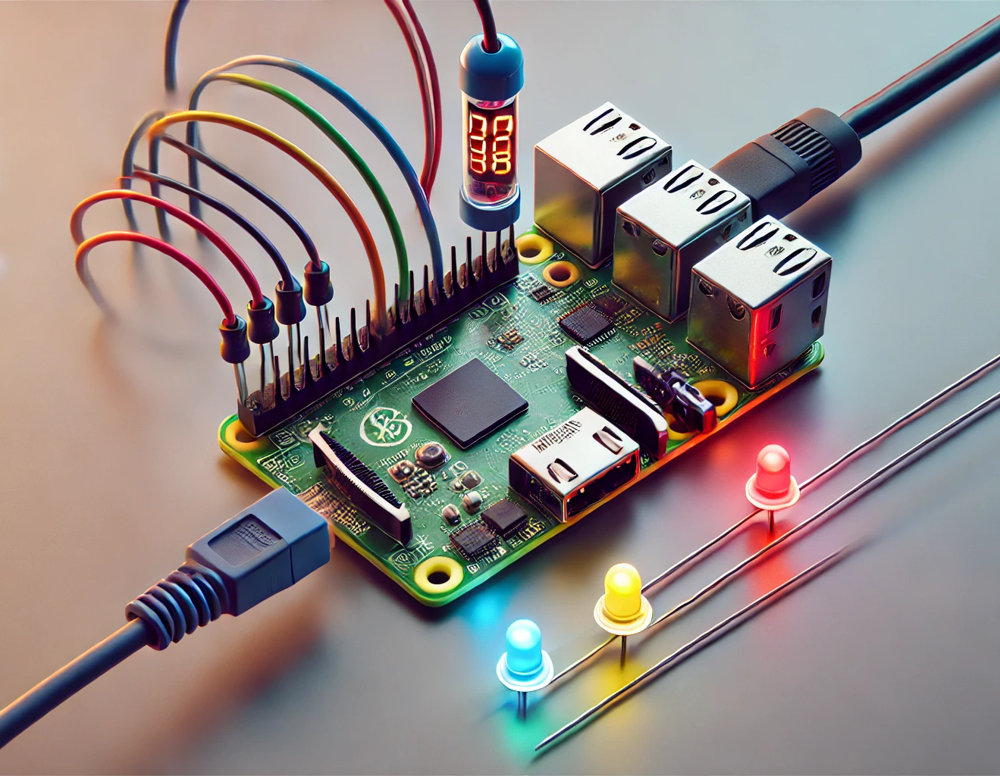
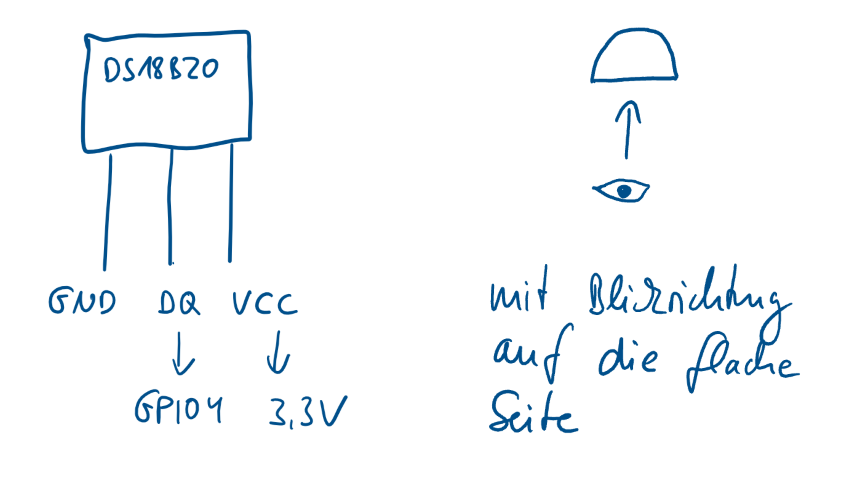
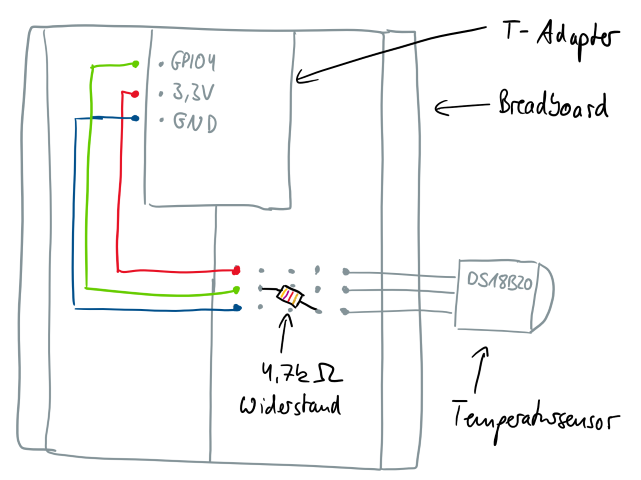
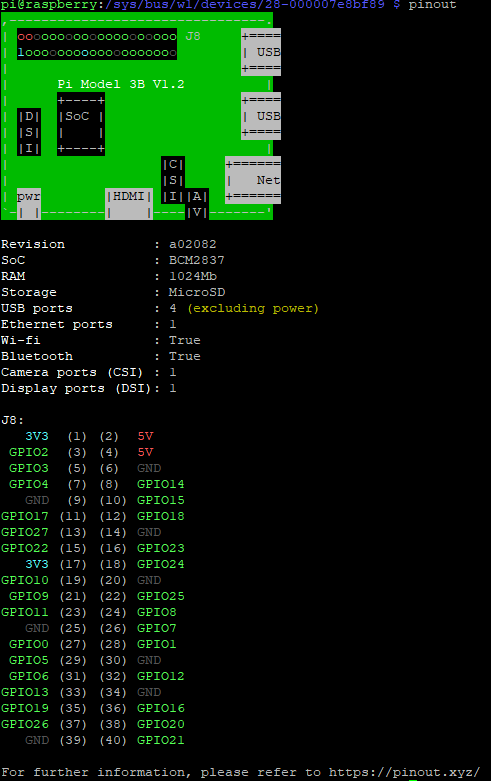
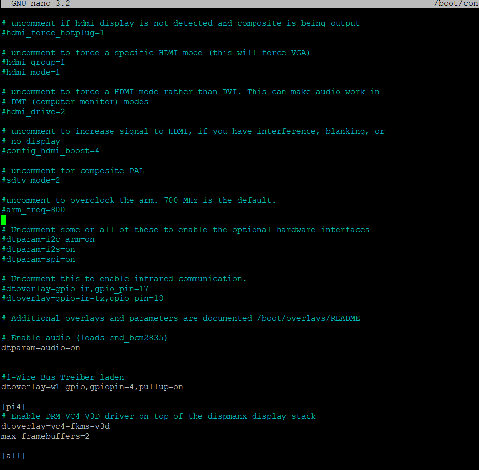
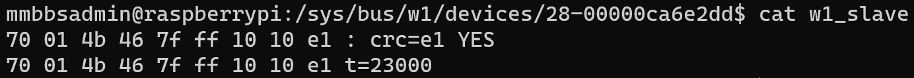

# Kapitel 5: Sensoren und Aktoren am Raspberry Pi nutzen


In diesem Kapitel werden Sie ...

- ... den Temperatursensor DS18B20 am Raspberry Pi in Betrieb nehmen.
- ... die RGB-LED am Raspberry Pi in Betrieb nehmen.
- ... die Single-Color-LEDs am Raspberry Pi in Betrieb nehmen.

---

!!! danger "Achtung"

    Im folgenden Kapitel werden Sie sich mit elektrotechnischen Größen beschäftigen, um schließlich den Temperatursensor zu betreiben. Schließen Sie keine elektrischen Bauteile an den Raspberry Pi an, ohne sich sicher zu sein, dass Sie einen korrekten Aufbau geplant haben. Sollten Fehler im beim Anschließen der Bauteile geschehen, kann es dazu kommen, dass die internen Anschlüsse der GPIO-Pins des Raspberry Pi irreparabel zerstört werden.

## Handlungssituation

Die Temperaturmesseinrichtung soll nun als Prototyp realisiert werden. Dafür sind einerseits der Temperatursensor sowie andererseits die visuelle Wiedergabe der Temperatur mittels LED einzurichten. Da es sich um einen Prototyp handelt, sollen zwei Varianten miteinander verglichen werden: einerseits die Darstellung der Temperatur mittels RGB-LED und andererseits die Darstellung mit mehreren Single-Color-LED.



## Kompetenz 5.0: Temperatursensor DS18B20 in Betrieb nehmen

Im ersten Schritt soll der Temperatursensor am Raspberry Pi angeschlossen und mittels Python-Programm ausgelesen werden. Hierfür steht Ihnen das betriebsinterne Wiki als Auszug der Wissensdatenbank bereit.

### Arbeitsauftrag A|5.0: Inbetriebnahme des DS18B20

Sie beginnen mit der Inbetriebnahme des Temperatursensors.

- Führen Sie gemäß des Informationsmaterials im Kurs die Inbetriebnahme des Temperatursensors durch (M|5.0: Auszug aus dem Wiki zum DS18B20).
- Weitere Informationen über Elektrotechnik-Basics finden Sie ebenfalls im Kurs (M|5.1: Grundlagen der Elektrotechnik).
- Alle Informationen zu Ihren Elektrobauteilen aus dem Raspberry Pi Set finden Sie im Kurs (M|5.2: Übersicht zum MMBbS Raspberry Pi Set).
- Testen Sie die Funktionstüchtigkeit, indem Sie das Script ausführen und den Temperatursensor durch Berührung erwärmen.

### Informationsmaterial M|5.0: Auszug aus dem Wiki zum DS18B20

#### Der Temperatursensor DS18B20

Der Temperatursensor DS18B20 ist unter anderem im To-92 Gehäuse (Transistorgehäuse) verfügbar. In diesem kleinen Gehäuse befindet sich eine Temperaturmesschaltung und eine Logik mit Speichern, die es ermöglicht den gemessenen Temperaturwert über eine digitale Schnittstelle auszulesen.

Laut Datenblatt liegt die Messgenauigkeit zwischen -10°C und +85°C, bei ± 0,5°C.

Der Temperatursensor hat drei Anschlüsse (siehe Abbildung unten).

- VDD: Spannungsversorgung
- DQ: Datenleitung 1-Wire Bus
- GND: Masse



#### DS18B20 an den Raspberry Pi anschließen

Damit die aktuelle Raumtemperatur gemessen werden kann, muss der Temperatursensor mit dem Raspberry Pi verbunden werden.

!!! danger "Achtung"
    
    Um eine Beschädigungen des Raspberry Pi, des Temperatursensors oder weiterer Hardware zu vermeiden, ziehen Sie die Versorgungsspannung vom Raspberry Pi (direkt am Pi) ab! Schließen Sie die Versorgungsspannung erst wieder an, wenn Sie sich 100% sicher sind, dass Sie alles richtig verdrahtet haben!

#### Anschluss des Sensors an den Pi

1. **VDD (3)** Anschluss des Temperatursensors mit der 3,3VSpannungsversorgung des Raspberry Pis verbinden.
2. **GND (1)** Anschluss des Temperatursensors mit einem GroundAnschluss des Raspberry Pis verbinden.
3. **DQ (2)** Anschluss des Temperatursensors mit dem GPIO 4 Anschluss des Raspberry Pis verbinden.
4. Außerdem muss **zwischen Pin 3 und Pin 2 ein 4,7 kOhm Widerstand** angeschlossen werden, wie in der folgenden Abbildung zu sehen ist. (Nähere Infos zum 4,7kOhm Widerstand: siehe Datenblatt Seite 4 Figure 3)

Die folgenden drei Abbildungen visualisieren dies noch einmal:

##### Abbildung 1



##### Abbildung 2

In der Konsole des Raspberry Pi kann das zur Version passende PINOUT angezeigt werden. Dieses ist auch unter https://pinout.xyz/ einsehbar.

Der Befehl `pinout` öffnet auf dem Raspberry Pi folgende Ansicht:



##### Abbildung 3


##### Abbildung 4


#### Konfiguration des Betriebssystems

Im Raspbian ist bereits ein Treiber für den 1-Wire Bus enthalten. Dieser muss nur noch eingesschaltet werden und das funktioniert so:

Öffnen Sie bitte die Datei `/boot/config.txt` (z.B. mit Befehl: `sudo nano /boot/config.txt`) und fügen Sie vor `[pi4]` Zeilen(n) hinzu:

```
#1-Wire Bus Treiber laden
dtoverlay=w1-gpio,gpiopin=4,pullup=on
```

Achtung, bei w1 ist es ein kleines w und eine Eins!

Die Datei sollte dann so aussehen:



Speichern Sie die Änderungen mit `STRG + O` (mit `Enter` bestätigen) und schließen Sie den Texteditor mit `STRG + X`.

Nach einem Neustart des Raspberry Pi (Befehl: `sudo reboot now`) sollte der Temperatursensor funktionieren.

#### Test des Temperatursensors

Die Temperatur des Sensors ist nun über das Linux Dateisystem abrufbar.

Wechseln Sie in das Verzeichnis `/sys/bus/w1/devices` (Befehl: `cd /sys/bus/w1/devices`) und lassen sich den Inhalt des Ordners (Befehl: `ls`) anzeigen.


Jeder Ordner der in dem Format `xx-xxxxxxxxxxxx` angezeigt wird, ist ein Sensor. Der Ordnername (hier: `28-00000ca6e2dd`) ist gleichzeitig die ID des Sensors. Ihr Sensor hat natürlich eine eigene ID.

Wechseln Sie nun in den Ordner `xx-xxxxxxxxxxxx` und lassen sich den Inhalt des Ordners anzeigen (Befehl: `ls`).


Die Datei `w1_slave` ist für uns interessant, da Sie den aktuellen Temperaturwert enthält.

Geben Sie den Inhalt der Datei `w1_slave` aus (Befehl: `cat /sys/bus/w1/devices/xx-xxxxxxxxxxxx/w1_slave`).



In der Datei ist der Temperaturwert (hier 23,0°C) abgespeichert.

#### Python-Script zum Auslesen des Sensors

1. Legen Sie im ersten Schritt einen Ordner im Home-Verzeichnis von pi mit dem Namen "Projekte" und darin einen Unterordner mit dem Namen "Temperaturmessung" an.
2. Im Ordner Temperaturmessung erstellen Sie anschließend eine Datei mit dem Namen "ds18b20_auslesen.py" an.
3. Fügen Sie den Quellcode s.u. in die eben erstellte Datei ein.
4. Vergeben Sie die Ausführrechte für den Besitzer der Datei (pi).
5. Führen Sie das Script aus.

##### Quellcode für das Python-Script: ds18b20_auslesen.py

``` python

#!/usr/bin/python
#coding=utf-8
#ds18b20_auslesen.py
#---------------

import os, sys, time

# Erstellen der Funktion zum Ermitteln der aktuellen Temperatur
def aktuelleTemperatur():

    # 1-wire Slave Datei lesen
    file = open('/sys/bus/w1/devices/28-000007e8bf89/w1_slave')
    filecontent = file.read()
    file.close()

    # Temperaturwerte auslesen und konvertieren
    stringvalue = filecontent.split("\n")[1].split(" ")[9]
    temperature = float(stringvalue[2:]) / 1000

    # Temperatur ausgeben
    rueckgabewert = '%6.2f' % temperature
    return(rueckgabewert)

# Deklaration der Variablen
schleifenZaehler = 0
schleifenAnzahl = 20
schleifenPause = 1

# Ausgabe der aktuellen Temperatur und der Nummer des Schleifen-Durchlaufes
print "Temperaturabfrage für ", schleifenAnzahl," Messungen alle ", schleifenPause ," Sekunden gestartet"

while schleifenZaehler <= schleifenAnzahl:
    messdaten = aktuelleTemperatur()
    print "Aktuelle Temperatur : ", messdaten, "°C","in der ", schleifenZaehler, ". Messabfrage"
    time.sleep(schleifenPause)
    schleifenZaehler = schleifenZaehler + 1

# Ausgabe zum Ende des Programmes
print "Temperaturabfrage beendet"

```

### Informationsmaterial M|5.1: Grundlagen der Elektrotechnik

[Download Informationsmaterial PDF](material/05_Grundlagen_E-Technik.pdf)

### Informationsmaterial M|5.2: Übersicht zum MMBbS Raspberry Pi Set

[Download Informationsmaterial PDF](material/05_RaspberryPiSet.pdf)

## Kompetenz 5.1: RGB-LED in Betrieb nehmen

Nachdem der Temperatursensor funktionell eingebunden wurde, soll im nächsten Schritt die erste Variante der Darstellung der Temperatur geprüft werden. Hierzu ist die RGB-LED in Betrieb zu nehmen und in Abhängigkeit der Temperatur zum Leuchten zu bringen. Auch hierfür steht Ihnen die Wissensdatenbank der ChangeIT zur Verfügung.

### Arbeitsauftrag A|5.1: Inbetriebnahme der RGB-LED

Führen Sie gemäß des Informationsmaterials im Kurs die Inbetriebnahme der RGB-LED durch. Testen Sie die Funktionstüchtigkeit, indem Sie das Script ausführen.

### Informationsmaterial M|5.3: Auszug aus dem Wiki zur RGB-LED

#### 1. Vorbereitung

Schalten Sie den Raspberry Pi aus, um Beschädigungen zu vermeiden, während Sie die Verbindungen herstellen.

#### 2. RGB-LED auf dem Breadboard platzieren

Setzen Sie die RGB-LED auf das Breadboard, so dass jede der vier Pins in einer separaten Reihe sitzt. Ein Schaubild finden Sie im Informationsmaterial M|5.2: Übersicht zum MMBbS Raspberry Pi Set.

#### 3. Anodenverbindung

Der längste Pin der RGB-LED ist die gemeinsame Anode. Verbinden Sie diesen Pin mit der 3.3V-Stromversorgung des Raspberry Pi.

Nutzen Sie hierfür den Raspberry Pi, schließen Sie das 40-Pin-Flachbandkabel an und am anderen Ende den T-Adapter. Der T-Adapter muss dann auf das Breadboard gesteckt werden.

#### 4. Widerstände einfügen

Verbinden Sie die Kathoden (die anderen drei Pins) der RGB-LED über separate Widerstände mit verschiedenen Reihen des Breadboards. Dies hilft, den Strom zu begrenzen und die LED vor Schäden zu schützen.

#### 5. Verbindungen zu den GPIO-Pins

Verwenden Sie die Jumper-Kabel, um die anderen Enden der Widerstände mit den GPIO-Pins des Raspberry Pi zu verbinden. Zum Beispiel:
- Rote LED-Kathode -> Widerstand -> GPIO 17
- Grüne LED-Kathode -> Widerstand -> GPIO 27
- Blaue LED-Kathode -> Widerstand -> GPIO 22

#### 6. Softwarekonfiguration

Starten Sie den Raspberry Pi und öffnen Sie ein Terminal.

Erstellen Sie ein Python-Skript zum Steuern der RGB-LED.
Beispielskript:

``` python

import RPi.GPIO as GPIO
import time

# GPIO-Modus (BOARD / BCM)
GPIO.setmode(GPIO.BCM)

# GPIO-Pins zuweisen
RED_PIN = 17
GREEN_PIN = 27
BLUE_PIN = 22

# Setze die GPIO-Pins auf OUTPUT
GPIO.setup(RED_PIN, GPIO.OUT)
GPIO.setup(GREEN_PIN, GPIO.OUT)
GPIO.setup(BLUE_PIN, GPIO.OUT)

# PWM-Instanzen erstellen
red = GPIO.PWM(RED_PIN, 100)
green = GPIO.PWM(GREEN_PIN, 100)
blue = GPIO.PWM(BLUE_PIN, 100)

# PWM starten mit 0% (LED aus)
red.start(0)
green.start(0)
blue.start(0)
def setColor(r, g, b):
    red.ChangeDutyCycle(100 - r)
    green.ChangeDutyCycle(100 - g)
    blue.ChangeDutyCycle(100 - b)

try:
    while True:
        # Grundfarben und deren Kombinationen
        colors = [
            (100, 0, 0),   # Rot
            (0, 100, 0),   # Grün
            (0, 0, 100),   # Blau
            (100, 100, 0), # Gelb (Rot + Grün)
            (0, 100, 100), # Cyan (Grün + Blau)
            (100, 0, 100), # Magenta (Rot + Blau)
            (100, 100, 100) # Weiß (Rot + Grün + Blau)
        ]
        
        for color in colors:
            setColor(*color)
            time.sleep(1)

except KeyboardInterrupt:
    pass

# PWM stoppen
red.stop()
green.stop()
blue.stop()

# GPIO-Pins zurücksetzen
GPIO.cleanup()

```

#### 7. Skript ausführen

Speichern Sie das Skript, z.B. als `rgb_led.py`, und führen Sie es mit folgendem Befehl aus: `python3 rgb_led.py`.

### Arbeitsauftrag A|5.2: RGB-LED in Abhängigkeit der Temperatur ansteuern

Steuern Sie die RGB-LED in Abhängigkeit der Temperatur des Sensors an. Nutzen Sie dafür die beiden Beispielscripte aus der Inbetriebnahme des Temperatursensors sowie der LED als Basis und erstellen Sie ein eigenes neues, welches wie folgt funktioniert:

Definieren Sie zwei Grenzwerte für kalte bzw. warme Temperaturen. Wenn der untere Grenzwert unterschritten wird, leuchtet die RGB-LED blau. Wenn der obere Grenzwert überschritten wird, rot und ansonsten grün.

## Kompetenz 5.2: Single-Color-LEDs in Betrieb nehmen

Eine zweite Variante zur Darstellung der Farben soll auf Basis der bisherigen Erkenntnisse und Beispiele aus dem Wiki mittels Single-Color-LED aufgebaut werden. Da diese Option bisher noch nicht innerbetrieblich dokumentiert ist, erstellen Sie selbst das Script sowie eine kurze Anleitung zur Umsetzung.

### Arbeitsauftrag A|5.3: Inbetriebnahme der Single-Color-LEDs

Führen Sie gemäß des Informationsmaterials im Kurs die Inbetriebnahme der Single-Color-LEDs durch (M|5.4: Auszug aus dem Wiki zur Single-Color-LED). Testen Sie die Funktionstüchtigkeit, indem Sie das Script ausführen.

### Informationsmaterial M|5.4: Auszug aus dem Wiki zur Single-Color-LED

#### 1. Vorbereitung

Schalten Sie den Raspberry Pi aus, um Beschädigungen zu vermeiden, während Sie die Verbindungen herstellen.

#### 2. LED und Widerstand auf dem Breadboard platzieren

Setzen Sie die LED auf das Breadboard. Der längere Pin der LED ist die Anode (+) und der kürzere Pin ist die Kathode (-).
Verbinden Sie die Kathode der LED (kürzere Pin) mit GND des Raspberry Pi.

Verbinden Sie die Anode der LED (längere Pin) über den Widerstand (Widerstände s. M|5.2: Übersicht zum MMBbS Raspberry Pi Set) mit einem GPIO-Pin des Raspberry Pi

#### 3. Softwarekonfiguration

Starten Sie den Raspberry Pi und öffnen Sie ein Terminal.

#### 4. Python-Skript erstellen

Erstellen Sie ein Python-Skript, um die LED blinken zu lassen.
Beispielskript:

``` python

import RPi.GPIO as GPIO
import time

# GPIO-Modus (BOARD / BCM)
GPIO.setmode(GPIO.BCM)

# GPIO-Pin zuweisen
LED_PIN = 18

# Setze den GPIO-Pin auf OUTPUT
GPIO.setup(LED_PIN, GPIO.OUT)

try:
    while True:
        GPIO.output(LED_PIN, GPIO.HIGH)  # LED einschalten
        time.sleep(1)                    # 1 Sekunde warten
        GPIO.output(LED_PIN, GPIO.LOW)   # LED ausschalten
        time.sleep(1)                    # 1 Sekunde warten

except KeyboardInterrupt:
    pass

# GPIO-Pin zurücksetzen
GPIO.cleanup()

```

#### 5. Skript ausführen

Speichern Sie das Skript, z.B. als `blink_led.py`, und führe es mit folgendem Befehl aus: `python3 blink_led.py`

### Arbeitsauftrag A|5.4: Single-Color-LEDs in Abhängigkeit der Temperatur ansteuern

Steuern Sie die mehrere Single-Color-LEDs in Abhängigkeit der Temperatur des Sensors an. Nutzen Sie dafür die beiden Beispielscripte aus der Inbetriebnahme des Temperatursensors sowie der LEDs als Basis und erstellen Sie ein eigenes neues, welches wie folgt funktioniert:

Definieren Sie entsprechend der Anzahl der Single-Color-LEDs Grenzwerte für sehr kalte, kalte, normale, warme bzw. sehr warme Temperaturen. Wenn die Temperatur einen entsprechenden Wert erreicht, soll die dazugehörige LED leuchten.

## GitHub

### GitHub.io - LF2-Kurs als MkDocs-Variante

[https://herr-nm.github.io/MMBbS_FISI_LF02/](https://herr-nm.github.io/MMBbS_FISI_LF02/)

