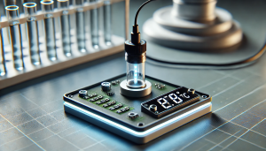

# Kapitel 6: Exkurse und weitere Themen

In diesem Kapitel ...

- ... finden Sie die Vortragsfolien für Exkurse.

---

## Anforderungen ermitteln

### Vortragsfolien - Exkurs Anforderungen ermitteln

[Download der Vortragsfolien als PDF](material/06_Exkurs_Anforderungsanalyse.pdf)

## Gütesiegel Energieeffizienz

### Vortragsfolien - Exkurs Gütesiegel Energieeffizienz

[Download der Vortragsfolien als PDF](material/06_Exkurs_Energieeffizienz.pdf)

## Formatierung von Speichern

### Vortragsfolien - Exkurs Formatierung von Speichern

[Download der Vortragsfolien als PDF](material/06_Exkurs_Formatierung_von_Speichern.pdf)

## BIOS und UEFI

### Vortragsfolien - BIOS und UEFI

[Download der Vortragsfolien als PDF](material/06_Exkurs_BIOS_und_UEFI.pdf)

## GitHub

### GitHub.io - LF2-Kurs als MkDocs-Variante

[https://herr-nm.github.io/MMBbS_FISI_LF02/](https://herr-nm.github.io/MMBbS_FISI_LF02/)

